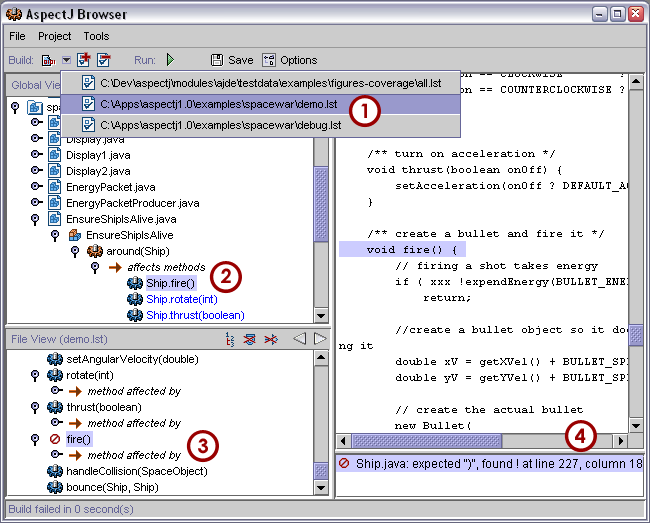
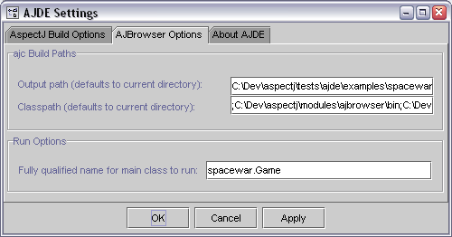

[[ajbrowser]]
== AspectJ Browser

[[ajbrowser-intro]]
=== Introduction

AJBrowser presents a GUI for compiling programs with ajc and navigating
crosscutting structure.

The AspectJ Browser can edit program source files, compile using the
AspectJ compiler `ajc` run a program, and graphically navigate the
program's crosscutting structure. For more information on `ajc`, see
xref:ajc.adoc[`ajc`, the AspectJ compiler/weaver].

Launch the browser from the command line either by typing "ajbrowser" to
invoke the script in `{aspectj}/bin` (if AspectJ is installed correctly)
or by using the `aspectjtools.jar` directly, and specifying no arguments
or some number of build configuration files (suffix `.lst`):

[source, text]
....
java -jar aspectj1.1/lib/aspectjtools.jar aspectj1.1/doc/examples/spacewar/debug.lst
....

[[ajbrowser-building]]
=== Building Programs

==== Build Configurations

A build configuration is a set of files to compile for a program (and
optionally some additional compile arguments). Because `ajc` requires
all sources to be specified (at least using the `-sourceroots` option),
most users create `.lst` files that list the files to compile (one
argument per line, globbing permitted - for more details, see
xref:ajc.adoc[`ajc`, the AspectJ compiler/weaver]).

To work with a particular program, select the corresponding ".lst" build
configuration file from the GUI using the File menu, "open" item, or by
using the "Open Build Configuration" button
(image:openConfig.gif[image]). You can populate the build list from the
command line by passing any number of ".lst" paths. (However, if you
pass in any non-".lst" arguments, it will run the command-line compiler
directly.)

To switch between build configurations, select, add, or remove them
using the corresponding toolbar buttons.

Global build options are stored in an `.ajbrowser` file in your HOME
directory. Edit these from the GUI by clicking the "Options" button or
selecting the Tools menu item "Options...". This is how to set
classpath, aspectpath, etc.

The following sections walk through a build.

==== Compiling a Program Build Configuration

To compile click the "Build" button (image:build.gif[image]), or or use
the tools menu.

You may select from different build configurations in the GUI (see label
1 in the graphic below). (If you get classpath or other errors, set up
the global build options as described above.)

[[ajbrowser-navigating]]
=== Navigating Program Structure

Select nodes in the program structure by clicking them (see label 2). If
one node is related to one or more other nodes by an association the
name of the association will appear below that node and will be
displayed in italics. Links to other structure nodes appear in blue
below the association. If there is no corresponding source for the link
it will appear light-blue.

[[example]]
==== Example: Exploring the "Spacewar" sample code

* Launch `ajbrowser`
* Choose "File -> Open" or click the "Open Build Configuration" button
(image:openConfig.gif[image]) and select the configuration file for
debugging the spacewar example, in `examples/spacewar/debug.lst`.
* Click the "Build" button (image:build.gif[image]) to compile. The left
pane should fill with a spacewar declaration tree. If there is a
compiler error, the clickable error message shows up as in label 4.
+
Note: If you did not set up your classpath, the compile will fail with a
message that you need to install aspectjrt.jar on your compile
classpath. To do that, select "Tools -> Options" or click the "Options"
button (image:browseroptions.gif[image]). Click the `Build Options` tab
to view the Build Paths pane. Edit the classpath entry to use your
install location. For example, if you ran from the base Aspectj
directory, the classpath need only include `lib/aspectjrt.jar` (though
the browser may populate the classpath with the bootclasspath and
classpath initially.) Be sure to use the `lib/aspectjrt.jar` that came
with the browser.
+

* Different structure views: The structure tree at the left can display
different orderings and granularity for structure:
** The package hierarchy view shows the traditional hierarchy of
package, class, and members.
** The inheritance view shows the hierarchy from topmost parent classes
through subclasses to members.
** The crosscutting view shows the aspect members and the code they
affect.
** Additional buttons in the pane can be used to change the granularity
and filter out items.
+
Whenever you select an item in the tree view, the source pane scrolls to
that item. If you select a leaf item representing another program
element, then the tree selection will go to the corresponding node. (See
below for how to use two panes to maintain your place.)
* When working with aspects, it helps to be able to navigate between
different program elements:
** When looking at a method, find the advice that affects it.
** When looking at a pointcut, find the advice that uses it.
** When looking at advice, find what it advises - e.g., method calls or
executions, initializers, etc.
** When looking at a type, find any aspects that declare members or
supertypes of the type, or vice-versa.
+
You can view the advice on a particular method using the default,
hierarchical view. Navigate to the tree item for
`spacewar.Registry.register(SpaceObject)` in the `debug.lst` config
file. Now, in the lower, file view, you can see and navigate to the
advice using the subtree whose parent is the `method
                   affected by` relation.
+
You can also use crosscutting view to see the advice using a pointcut or
the methods affected by advice. For example, to see what advice uses a
particular pointcut, navigate to the tree item for the pointcut
`spacewar.Debug.allConstructorsCut()` in the `debug.lst` config file.
You can see and navigate to the advice that uses the pointcut using the
`pointcut used by` relation.
+
As an example of seeing the methods affected by advice, while still in
the same view, select the first `before` advice in `spacewar.Debug`. It
has relation sub-trees for both `uses pointcut` and
`affects constructions`. The `affects` relations will list different
kinds of join points - constructor or method calls, etc.
+
Note that the AspectJ browser can only display static structure (whether
hierarchical or crosscutting). That means that dynamicly-determined
pointcuts (like `cflow(pointcut)`) will not be shown as picking out
static points in source code. Displayable pointcuts roughly correspond
to those that can be used in a `declare error` statement.

[[ajbrowser-running]]
=== Running Programs

The browser supports a limited form of running compiled programs. To run
programs that have been built, click the run button or select one of the
run menu items in the project menu. You can run in the same VM or spawn
a new process; the latter is generally better for GUI programs.

Both require that any classpath you set be specified using
platform-specific paths and path separators (the compiler might be more
tolerant). Output and error streams will be merged into the streams of
the browser (using separate threads, so it may take a few seconds for
the pipe threads to gain control.) Errors should be detected and
displayed in a dialog.

The GUI does not support killing a running program, so if your program
might hang, be sure to save your files since you may need to kill the
browser itself to kill its child processes.

[[ajbrowser-problems]]
=== Isolating problems running the AspectJ browser

If you have problems with the browser not solved by the documentation,
please try to see if you have the same problems when running ajc
directly on the command line.

* If the problem occurs on the command line also, then the problem is
not in the browser. (It may be in the compiler; please send bug
reports.)
* If the problem does not occur on the command line, then it may lie in
the parameters you are supplying in the build options.
* If the build options look correct and the problem only occurs when
building from the browser, then please submit a bug report.

[[ajbrowser-knownProblems]]
==== Known issues with the AspectJ browser

For the most up-to-date information on known problems, see the
http://bugs.eclipse.org/bugs[bug database] for unresolved
http://bugs.eclipse.org/bugs/buglist.cgi?&product=AspectJ&component=Compiler&bug_status=NEW&bug_status=ASSIGNED&bug_status=REOPENED[compiler
bugs] or
http://bugs.eclipse.org/bugs/buglist.cgi?&product=AspectJ&component=IDE&bug_status=NEW&bug_status=ASSIGNED&bug_status=REOPENED[IDE
bugs] .

* Memory and forking: Users email most about the browser task running
out of memory. This is not a problem with the browser; some compiles
take a lot of memory, often more than similar compiles using javac. The
browser does not support forking, so the only solution is to edit the
java command line or script that launches the browser to add memory.
* Editing build configuration files: this is not currently supported.
* The structure model is incomplete after incremental compiles. To get a
complete structure model requires a full build.
* If you change the output directory, you must do a full build.

[[ajbrowser-limitations]]
==== Limitations

* The AJBrowser expects the package and directory structure to match. If
they do not it will be unable to browse to the corresponding file.
* The "Run" feature launches applications in the same VM. As a result,
if a Swing application is disposed the AJBrowser will be disposed as
well.

[[ajbrowser-feedback]]
==== AspectJ Browser questions and bugs

You can send email to aspectj-users@dev.eclipse.org. (Do join the list
to participate!) We also welcome any bug reports, patches, and feature
requests; you can submit them to the bug database at
http://bugs.eclipse.org/bugs using the AspectJ product and IDE
component.
