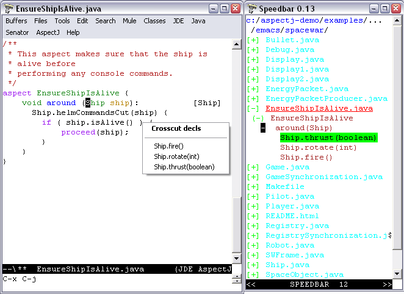

AJDEE

JDEE support for XEmacs and GNU Emacs

== AJDE for Emacs User's Guide

This guide describes AspectJ-mode extensions of JDEE for GNU Emacs and
XEmacs, which provides enhanced editing and management of AspectJ code
via a minor mode extension of JDE mode. AJDEE's AspectJ support builds
on xref:#aspectj-mode[aspectj-mode's] extension of java-mode, also
provided with the release. Included in this document are guidance for
AJDEE's xref:#ajdee-featuresandusage[use], including an
xref:#exploringspacewar[exploration of spacewar], and
xref:#ajdee-installationetc[installation and compatibility]. See the
README file in AJDEE's distribution directory for release-specific
details.

In addition to the java-mode extensions provided by
xref:#aspectj-mode[aspectj-mode], AJDEE provides (see graphic):

* Viewing and navigation of aspect structures via the the speedbar and
Classes menu.
* Basic support for completion.
* Integrated Javadoc support.

[[ajdee-featuresandusage]]
== AJDEE Features and Usage

The AJDEE extensions of JDE require no special effort to use. The
speedbar and Classes menus provide additional sublists showing
crosscutting structure. Selecting items in those lists navigates to the
referenced item.

=== Aspect Structure and Navigation

==== Enhancements to Speedbar in JDE Mode

As a minor mode of JDE mode, AJDEE enhances the speedbar to show the
location of aspect, advice, and inter-type declarations. The
affects/affected-by relationships are shown in the speedbar rather than
embedding tags in the text (available as an option), and selecting the
items in the speedbar will perform the expected navigation. The speedbar
symbols have been extended for AspectJ as follows (see right side of
xref:#ajdeemacsscreenshot[figure)]:

.Enhancements to Speedbar in JDE Mode
[cols=",",options="header",]
|===
|Indication |Meaning
|`(+) ` _`name`_ |A class, interface, or aspect; double mouse-1 will
display its declarations
|`+  ` _`methodSignature`_ |Method has an advice that applies to it;
double mouse-1 will display the relevant advice.
|`+  ` _`adviceSignature`_ |Advice declared by the containing aspect;
double mouse-1 will display affected methods.
|`+  ` _`introductionSig`_ |Inter-type declaration declared by the
containing class; double mouse-1 will display affected methods or
classes.
|`| | ` _`methodOrFieldSig`_ |Method or field has been declared by an
aspect; double mouse-1 on text will navigate to the declaration; a +
within the bars means that it has an advice that applies to it.
|===

A minus (`-`) is displayed on the item when the crosscutting items are
displayed. AspectJ structure information is derived from the last
compile of your AspectJ program.

=== Compilation and JavaDoc

The option `AspectJ Compile File Specification` can be customized from
the Customize options under the AspectJ menu, changing the default
compile specification given to `ajc`. See
xref:#ajdee-installationetc[installation instructions] for examples and
other customizations.

AspectJ JavaDoc support is enabled by setting `Jde Javadoc Command Path`
to invoke `ajdoc`. These are the default settings provided in the
installation instructions.

[[exploringspacewar]]
== Exploring the Spacewar Source Code

To begin exploring Spacewar within emacs using JDE and AspectJ mode:

* Compile spacewar.
* Change into the `spacewar` directory.
* Type `emacs Ship.java`.
* Pull down the JDE menu and select the Speedbar entry to show the
AspectJ files in the directory. Note that `Ship.java` is shown in red to
denote that it is currently shown in the main buffer.
* Double-click with the left mouse button on the `+` in front of the
`Ship.java` entry. It should display an entry for the class `Ship`.
* Double-clicking on Ship will navigate to its declaration in the
buffer. Note that declarations of advice are annotated to note the types
of objects that they advise, declarations of methods that are advised
are annotated with the aspects that advise them, and so forth.
* Double-clicking on the `+` in front of either will show the declared
fields, methods, inter-type declarations, and advice. A `+` in front of
any field or method means that it is introduced or advised;
double-clicking will list entries for the introducers/advisers;
double-clicking on them will navigate to their declarations. A `+` in
front of any inter-type declarations or advice will will display its
targets.

[[ajdee-installationetc]]
== Installation and Compatibility

AJDEE requires the installation of http://sunsite.auc.dk/jde[JDE
2.2.9beta4] or higher and small edits to your `.emacs` file to configure
AJDEE and enable autoloading AJDEE when a `.java` file is loaded.

=== Installation for enhancement of JDE mode

The first and last steps, with enhancements, can be found in the example
Emacs initialization file `sample.emacs` and the sample JDE project file
`sample.prj` in the distribution. The latter also demonstrates a way to
enable AspectJ mode on a per-project basis.

[arabic]
. Make sure AJDEE, aspectj-mode, JDE, and supporting packages are on
your `load-path` and are ``required''. This is an example for the 1.0
release:
+
....
   ;; I keep my emacs packages in C:/Emacs
   (setq load-path
   (append
'(
 "C:/Emacs/aspectj-emacsMode-1.0"   ; for AJDEE
 "C:/Emacs/aspectj-emacsAJDEE-1.0"
 "C:/Emacs/jde-2.2.9beta6/lisp"
 "C:/Emacs/elib-1.0"            ; for JDEE
 "C:/Emacs/speedbar-0.14beta2"  ; for JDEE
 "C:/Emacs/semantic-1.4beta12"  ; for JDEE/speedbar
 "C:/Emacs/eieio-0.17beta3"     ; for JDEE
 )
load-path))

   (require 'jde)
   (require 'ajdee) ; can also appear in prj.el

....
. _[Optional]_ add `-emacssym` switch to the `ajc` and `ajc.bat` files
in your AspectJ tools installations (in the `/bin` directory). If you
invoke the compiler outside Emacs, this will ensure that your compiles
always generate information for annotations and the jump menu in the
form of `.ajesym` files.
. Customize AJDEE's compile options by putting a version of the
following in your `.emacs` file or in a JDE project file `prj.el` in
your project's hierarchy (see the `JDE Project File Name` option for the
latter). Here is a simple example:
+
....
;; A default version for simple projects, maybe good for
;;; .emacs file.
(custom-set-variables
'(jde-compiler '("ajc" "ajc"))
'(jde-javadoc-command-path "ajdoc")

;; ajc requires all files to be named for a compile
'(aspectj-compile-file-specification "*.java"))

....
+
Here is an example for spacewar, in `examples/spacewar`.
+
....
;;; These options are for the spacewar, in examples/spacewar.
(custom-set-variables
'(jde-compiler '("ajc" "ajc"))
'(jde-javadoc-command-path "ajdoc")

;; ajc provides an ``argfile'' mechanism for specifying all files.
'(aspectj-compile-file-specification "-argfile demo.lst")

;; *if* compiling packages, name root dir for package hierarchy
;; to tell ajc where .class files should go.
'(jde-compile-option-directory "..")
'(jde-run-working-directory ".."))
'(jde-run-application-class "spacewar.Game")

....
. _[XEmacs only]_ If you're installing JDE yourself, be sure to closely
follow the JDE installation directions for XEmacs, otherwise you may get
out of date JDE `.jar` files.

=== Customizing Options

Selecting Customize options from the AspectJ menu displays a number of
options that customize AspectJ mode. These control whether annotations
are shown by default, and whether the bovinator set up by JDE runs.
`AspectJ Compile File Specification`, specifies a compilation argument
as an alternative to the current buffer's file or the run class's file.
Example customizations are shown above and in the sample files discussed
above.

== Usage and Upgrade Problems

Please see the documentation for

aspectj-mode

for problems not specific to AJDEE's features.

* _Symptom_: Get standard speedbar menus in JDE; no annotations display.
Message:
+
....
AspectJ Mode Warning: Can't find declarations file for...
....
+
AspectJ file has not been compiled with ajc and the `-emacssym` flag, or
was compiled with an obsolete version of ajc. After compilation, there
should be a <file>.ajesym for every <file>.java in the build. If .ajsym
files are present but error persists, recompile. Note that aspectj-mode
for JDE has a fallback view for uncompiled files.
* _Symptom_: Navigations via the speedbar and the jump menu are off,
annotations are misplaced in the code.
+
AspectJ mode operates by querying data derived from the most recent
compile that includes the `-emacssym` flag. Recompile the entire program
with ajc including the switch. Consider permanently installing the
switch by editing the ajc and ajc.bat files in the /bin file in your
distribution.
* _Symptom_: Java files that are part of a Java project not written in
AspectJ come up in aspectj-mode.
+
Emacs uses the file suffix (.java) to determine which mode to invoke.
You can either globally toggle the AspectJ features from the AspectJ
menu, or you can prevent AJDEE from coming up by moving the (require
'ajdee) expression from your .emacs file to a prj.el file in each
AspectJ project's directory (see sample.prj in the distribution).
* _Symptom_: Reported bug fixes and new features to AJDEE are not seen,
or ajdee.el cannot be found or loaded, with message:
+
....
Error in init file: File error: "Cannot open load file", "ajdee"
....
+
Your load-path variable (set in your .emacs) is referring to an old
release. Change your load-path to point at the directory for the current
release. See the sample.emacs files in the distribution, for example.
