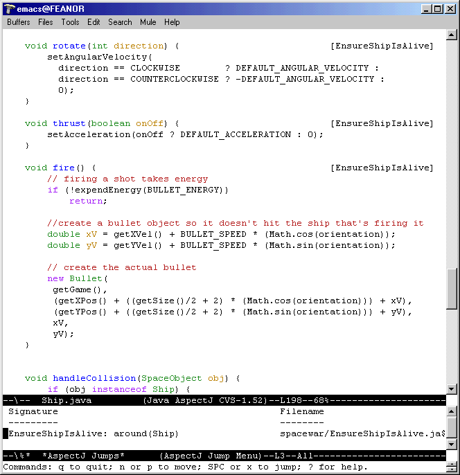

AspectJ-mode

support for XEmacs and GNU Emacs

== AspectJ-mode User's Guide

This guide describes aspectj-mode for GNU Emacs and XEmacs, which
provides enhanced editing and management of AspectJ code via a minor
mode extension of java-mode. Included in this document are guidance for
aspectj-mode's xref:#ajmode-featuresandusage[use], and
xref:#ajmode-installationetc[installation and compatibility]. See the
README file in the aspectj-mode's distribution directory for
release-specific details.

AspectJ minor mode provides (see graphic):

* Viewing and navigation of aspect structures, permitting navigation
between aspect code and the code that it affects, via a `jump' menu (and
in the speedbar and Classes menu for JDE users).
* Source code annotation of inter-type and advice declarations, as well
as the code they affect.
* AspectJ-style compilation, using .lst files to generate a compilation
submenu.
* Highlighting of AspectJ keywords and declaration names.

The first two are derived from ajc's last build of the AspectJ program.
An example usage is given below.

image:aspectj-mode.gif[image]

[[ajmode-featuresandusage]]
== Features and Usage

All commands governing AspectJ mode are available from the AspectJ menu
on the toolbar. Besides those described below, there is a menu item
Customize options for viewing and customizing the options of the mode
and AJ Mode user guide to view this file. Keyword and declaration
highlighting is enabled above the minimal level of highlighting.

By default, AspectJ mode is automatically turned on when a buffer named
with a `.java` suffix is entered. The command
`M-x aspectj-mode-in-force-toggle` globally toggles the features of the
mode, easing quickly moving between AspectJ and Java projects (also
available as AspectJ mode extensions in the AspectJ menu).

=== Aspect Structure and Navigation

AspectJ minor mode highlights aspect relationships in the text with
textual annotations on the program source (optionally can be turned
off), such as the `[Player, Robot, Ship]` marking after the advice in
EnsureShipIsAlive at the bottom of the
xref:#aspectjmodescreenshot[figure], which indicates that the advice
refers to join points within Ship objects. The following commands (also
available from the menu) manage annotations and navigation:

.AspectJ Minor Mode Commands for Annotations and Navigation
[cols=",",options="header",]
|===
|Command (keyboard shortcut) |Description
|M-x aspectj-jump-menu (C-x C-j) |Display popup menu of advisers,
advisees, and inter-type declarations. Navigate to item by selecting
with mouse (see xref:#aspectjmodescreenshot2[figure] below).

|M-x aspectj-show-annotations |Add crosscut annotations on the text on
current buffer.

|M-x aspectj-dont-show-annotations |Remove crosscut annotations from
text on current buffer.
|===

The default for whether annotations are shown or not can be customized
by selecting Customize options from the AspectJ menu.

=== Compilation

The Compile submenu accessible from the AspectJ menu presents the
known` .lst` files for the project. Selecting one compiles the project
with that `.lst` file and remembers that for future compiles. The
Compile... command accessible from the Emacs Tools menu is customized
through the project customization option `Aspectj Tools Compile
          Command`, customizable from the AspectJ menu.

[[ajmode-installationetc]]
== Installation and Compatibility

AspectJ mode requires the installation of
http://www.gnu.org/software/emacs/[GNU Emacs 20.3.1] or
http://www.xemacs.org/[XEmacs 21.1.14 (Unix/Linux)], or
http://www.xemacs.org/[XEmacs 21.4 (Windows)], or higher. In general,
the most recent non-alpha/beta versions of these are recommended. A web
browser is required to view this documentation via Emacs. Small
modifications to the `.emacs` file configures AspectJ mode and enables
autoloading AspectJ mode when a `.java` file is loaded.

=== Installation

Step 1, with enhancements, can be found in the example Emacs
initialization file `sample.emacs` in the distribution.

[arabic]
. The files in this package need to be in the load-path and
``required''. For example, for the 1.0 release:
+
....
;; I keep my emacs packages in C:/Emacs
(setq load-path (cons "C:/Emacs/aspectj-emacsMode-1.0" load-path))
(require 'aspectj-mode)

....
. _[Optional]_ add `-emacssym` switch to the `ajc` and `ajc.bat` files
in your AspectJ tools installations (in the `/bin` directory). If you
invoke the compiler outside Emacs, this will ensure that your compiles
always generate information for annotations and the jump menu in the
form of `.ajesym` files.
. _[XEmacs only]_ Go to the `xemacs-packages/lisp` directory of your
XEmacs distribution and move the `jde` directory to someplace harmless.
Otherwise, Java files will come up in JDE mode.

=== Customizing Options

Selecting Customize options from the AspectJ menu displays a number of
options that customize AspectJ mode. These control whether annotations
are shown by default, as well as a number of options controlling
compilation and beanshell for java-mode. Example customizations are
given in the file `sample.emacs` in the distribution.

== Usage and Upgrade Problems

* _Symptom_: No annotations show. Message:
+
....
AspectJ Mode Warning: Can't find declarations file for...
....
+
AspectJ file has not been compiled with ajc and the `-emacssym` flag, or
was compiled with an obsolete version of ajc. After compilation, there
should be a <file>.ajesym for every <file>.java in the build. If .ajsym
files are present but error persists, recompile. Note that aspectj-mode
for JDE has a fallback view for uncompiled files.
* _Symptom_: Annotations are misplaced in the code.
+
AspectJ mode operates by querying data derived from the most recent
compile that includes the `-emacssym` flag. Recompile the entire program
with ajc including the switch. Consider permanently installing the
switch by editing the ajc and ajc.bat files in the /bin file in your
distribution.
* _Symptom_: New customization option settings were saved for future
sessions, but do not show up when Emacs is restarted.
+
You may have two sets of saved settings in your .emacs file, and Emacs
updated the first one, which may be shadowed by the second.
* _Symptom_: Java files that are part of a Java project not written in
AspectJ come up in aspectj-mode.
+
Emacs uses the file suffix (.java) to determine which mode to invoke.
You can either globally toggle the AspectJ features from the AspectJ
menu.
* _Symptom_: Reported bug fixes and new features to aspectj-mode are not
seen, or aspectj-mode.el cannot be found or loaded, with message:
+
....
Error in init file: File error: "Cannot open load file", "aspectj-mode"
....
+
Your load-path variable (set in your .emacs) is referring to an old
release. Change your load-path to point at the directory for the current
release. See the sample.emacs files in the distribution, for example.
* _Symptom_: When trying to get a jump menu, I get the message "No
crosscut elements at point" even though there is a [list] on the same
line.
+
The caret (point) is probably on or after the list. To see the crosscut
elements you need to hit the jump menu on the same line that the
annotated elements appear as a list of items surrounded by '[' and ']'
on the same line as the affected declaration. If the caret is on the
same line as the elements and before the list (i.e. not at the end of
the list of elements) the jump menu should work.
