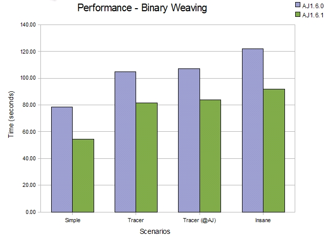
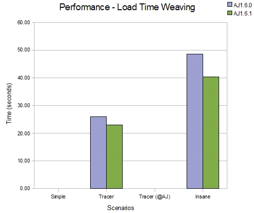
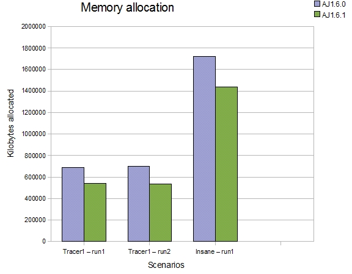
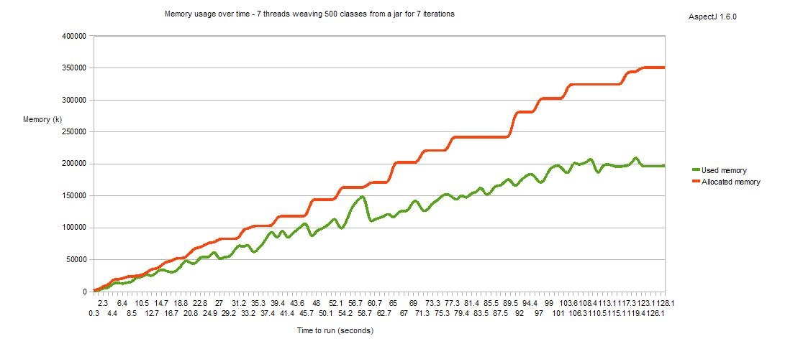

[.small]#© Copyright 2008 Contributors. All rights reserved.#

== AspectJ 1.6.1 Readme

The main themes of AspectJ1.6.1 are better memory usage and faster
weaving. This has been achieved through profiling of the weaving process
and has resulted in some serious refactoring of the weaver component
within AspectJ. It provides exactly the same functionality as in
previous releases, it just weaves faster now, using less code and less
memory. This readme will give an overview of the kind of changes made
and what can be expected when using 1.6.1 compared to previous releases.

The complete list of issues resolved for AspectJ 1.6.1 can be found with
these bugzilla queries. The first lists bugs addressed (more than 60!)
whilst the second details enhancements made in this release.

* https://bugs.eclipse.org/bugs/buglist.cgi?query_format=advanced&short_desc_type=allwordssubstr&short_desc=&product=AspectJ&target_milestone=1.6.1&long_desc_type=allwordssubstr&long_desc=&bug_file_loc_type=allwordssubstr&bug_file_loc=&status_whiteboard_type=allwordssubstr&status_whiteboard=&keywords_type=allwords&keywords=&bug_status=RESOLVED&bug_status=VERIFIED&bug_status=CLOSED&bug_severity=blocker&bug_severity=critical&bug_severity=major&bug_severity=normal&bug_severity=minor&bug_severity=trivial&emailtype1=substring&email1=&emailtype2=substring&email2=&bugidtype=include&bug_id=&votes=&chfieldfrom=&chfieldto=Now&chfieldvalue=&cmdtype=doit&order=Reuse+same+sort+as+last+time&field0-0-0=noop&type0-0-0=noop&value0-0-0=[Bugs
resolved]
* https://bugs.eclipse.org/bugs/buglist.cgi?query_format=advanced&short_desc_type=allwordssubstr&short_desc=&product=AspectJ&target_milestone=1.6.1&long_desc_type=allwordssubstr&long_desc=&bug_file_loc_type=allwordssubstr&bug_file_loc=&status_whiteboard_type=allwordssubstr&status_whiteboard=&keywords_type=allwords&keywords=&bug_status=RESOLVED&bug_status=VERIFIED&bug_status=CLOSED&bug_severity=enhancement&emailtype1=substring&email1=&emailtype2=substring&email2=&bugidtype=include&bug_id=&votes=&chfieldfrom=&chfieldto=Now&chfieldvalue=&cmdtype=doit&order=Reuse+same+sort+as+last+time&field0-0-0=noop&type0-0-0=noop&value0-0-0=[Enhancements
implemented]

'''''

=== Refactored (https://bugs.eclipse.org/bugs/show_bug.cgi?id=231396[bug 231396])

The bugzilla entry goes into more specifics on what has changed, the end
result is that aspectjweaver.jar has had around 275 classes removed
(about 25%) and has slimmed down by 350k (about 20%). In terms of
performance for different scenarios:

==== Straight compilation

The refactoring effort has been focused on the weaver component, hence
there is limited impact on the performance of source compilation but
this comparison shows it is faster. Four scenarios are compared, in each
scenario a different aspect is applied to the JDT compiler (just as a
sample piece of source code).

. 1100 source files, few aspects that target 859 join points.
. 1100 source files, code style trace aspect targeting public methods
(22000 join points)
. 1100 source files, annotation style trace aspect (22000 join points)
. 1100 source files, insane aspect (before(): within(*) \{}) (203000
join points)

image:perfSourceCompile_161.jpg[image]

==== Binary weaving

Moving on from source compilation to pure binary weaving, the
improvements are more obvious. Here we are using the complete JVM
classes jar 'rt.jar' as an example of a large jar file for weaving.

. Binary weaving rt.jar (~12000 classes) with a simple aspect (1200 join
points)
. Binary weaving rt.jar (~12000 classes) with a code style trace aspect
(121000 join points)
. Binary weaving rt.jar (~12000 classes) with an annotation style trace
aspect (121000 join points)
. Binary weaving rt.jar (~12000 classes) with an insane aspect
(before(): within(*) \{}) (352000 join points)

==== Loadtime weaving

The loadtime weaving improvements are similar to those seen for binary
weaving (naturally). Here we are using the JDK tools jar 'tools.jar' as
an example of a jar file for loadtime weaving.

. Binary weaving tools.jar (~1900 classes) with a code style trace
aspect
. Binary weaving tools.jar (~1900 classes) with an insane aspect
(before(): within(*) \{})

The refactoring work has also reduced the amount of unnecessary garbage
created on the heap during the weaving process. The next comparison
shows roughly the reduction in amount of 'stuff' created on the heap
during a weave. This isn't the max heap required to do a weave, it is
just showing how many less temporary objects are allocated during an
entire run of the weaver

. First, the number of kilobytes of memory allocated from the heap
during a weave of tools.jar with a code style trace aspect
. Second, another run of the same thing
. Third, this time using the insane aspect

So in terms of memory required, weaving the insane aspect into tools.jar
created 1.4G of 'stuff' over the entire weaving process, compared to
1.75G with 1.6.0.

==== Loadtime weaving stress

As well as addressing the memory usage of a single load time weaver, we
have also looked at the use of load time weaving in a larger scale
scenario, where multiple classloaders are being instantiated and
discarded over time and each has an associated load time weaver. Under
https://bugs.eclipse.org/bugs/show_bug.cgi?id=210470[bug 210470] we
looked in detail at whether the lifecycle of the weaver instance
correctly matched the lifecycle of the associated classloader. It did
not, but now it does! Here is a memory usage graph for AspectJ1.6.1 -
this shows an application that spawns 7 threads which run continuously
for a few minutes. Each thread repeatedly creates a classloader, weaves
500 classes using it then discards the classloader. You can see that
over time the memory is recovered correctly and when all threads
complete (and all classloaders are orphaned), all the weavers are
discarded.

First, AspectJ 1.6.0, in which memory was never correctly recovered and
so an OutOfMemory problem would always occur eventually.

And now AspectJ 1.6.1:

image:memLtwStress_161.jpg[image]

=== Incremental compilation

Following on from the work done to improve compilation under Eclipse in
AspectJ 1.6.0 (https://bugs.eclipse.org/bugs/show_bug.cgi?id=221427[Bug
221427] ) - we now support the building of 'broken code'
(https://bugs.eclipse.org/bugs/show_bug.cgi?id=102733[bug 102733]). This
is something the JDT has always been doing - where code containing
errors continues to build (if recovery is possible) but should the
actual methods containing the errors get invoked, an exception will be
thrown at runtime. A number of users typically extract large projects
from their library systems, knowing that they will only partially build
in their current eclipse setup, but as long at they do not invoke the
code containing the errors then they expect the rest of the project to
run normally. AspectJ now allows this mode of operation, and it has the
additional effect that the state of the project stays consistent, albeit
with known errors, and this means AspectJ will more frequently do
incremental builds rather than falling back to full builds because there
was a compilation error.

=== Language changes

==== Optmized syntax for annotation value binding (https://bugs.eclipse.org/bugs/show_bug.cgi?id=234943[Bug234943])

If only binding an annotation at a method-execution join point in order
to access an *enum value* within it, there is a more optimal syntax that
can be used to produce faster code. Given this setup:

``

....
enum Colour { RED,GREEN,BLUE;}

@interface ColouredAnnotation { Colour value(); }

@ColouredAnnotation(Colour.RED)
public void colouredMethod() { }
....

Current syntax:

....
before(ColouredAnnotation anno): execution(* *(..)) && @annotation(anno) {
  printTheColour(anno.value());
}
....

New optional syntax:

``

....
before(Colour col): execution(* *(..)) && @annotation(ColouredAnnotation(col)) {
  printTheColour(col);
}
....

'''''
