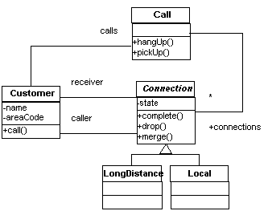

[[examples]]
= Examples

[[examples-intro]]
== Introduction

This chapter consists entirely of examples of AspectJ use.

The examples can be grouped into four categories:

technique::
  Examples which illustrate how to use one or more features of the language
development::
  Examples of using AspectJ during the development phase of a project
production::
  Examples of using AspectJ to provide functionality in an application
reusable::
  Examples of reuse of aspects and pointcuts

[[examples-howto]]
== Obtaining, Compiling and Running the Examples

The examples source code is part of the AspectJ distribution which may
be downloaded from the https://eclipse.org/aspectj[AspectJ project page].

Compiling most examples is straightforward. Go the `InstallDir/examples`
directory, and look for a `.lst` file in one of the example
subdirectories. Use the `-arglist` option to `ajc` to compile the
example. For instance, to compile the telecom example with billing, type

[source, text]
....
ajc -argfile telecom/billing.lst
....

To run the examples, your classpath must include the AspectJ run-time
Java archive (`aspectjrt.jar`). You may either set the `CLASSPATH`
environment variable or use the `-classpath` command line option to the
Java interpreter:

[source, text]
....
(In Unix use a : in the CLASSPATH)
java -classpath ".:InstallDir/lib/aspectjrt.jar" telecom.billingSimulation
....

[source, text]
....
(In Windows use a ; in the CLASSPATH)
java -classpath ".;InstallDir/lib/aspectjrt.jar" telecom.billingSimulation
....

[[examples-basic]]
== Basic Techniques

This section presents two basic techniques of using AspectJ, one each
from the two fundamental ways of capturing crosscutting concerns: with
dynamic join points and advice, and with static introduction. Advice
changes an application's behavior. Introduction changes both an
application's behavior and its structure.

The first example, xref:#examples-joinPoints[Join Points and `thisJoinPoint`], is about
gathering and using information about the join point that has triggered
some advice. The second example, xref:#examples-roles[Roles and Views],
concerns a crosscutting view of an existing class hierarchy.

[[examples-joinPoints]]
=== Join Points and `thisJoinPoint`

(The code for this example is in `InstallDir/examples/tjp`.)

A join point is some point in the execution of a program together with a
view into the execution context when that point occurs. Join points are
picked out by pointcuts. When a program reaches a join point, advice on
that join point may run in addition to (or instead of) the join point
itself.

When using a pointcut that picks out join points of a single kind by
name, typicaly the the advice will know exactly what kind of join point
it is associated with. The pointcut may even publish context about the
join point. Here, for example, since the only join points picked out by
the pointcut are calls of a certain method, we can get the target value
and one of the argument values of the method calls directly.

[source, java]
....
before(Point p, int x):
  target(p) &&
  args(x) &&
  call(void setX(int))
{
  if (!p.assertX(x))
    System.out.println("Illegal value for x"); return;
}
....

But sometimes the shape of the join point is not so clear. For instance,
suppose a complex application is being debugged, and we want to trace
when any method of some class is executed. The pointcut

[source, java]
....
pointcut execsInProblemClass():
  within(ProblemClass) &&
  execution(* *(..));
....

will pick out each execution join point of every method defined within
`ProblemClass`. Since advice executes at each join point picked out by
the pointcut, we can reasonably ask which join point was reached.

Information about the join point that was matched is available to advice
through the special variable `thisJoinPoint`, of type
xref:../runtime-api/org/aspectj/lang/JoinPoint.html[`org.aspectj.lang.JoinPoint`].
Through this object we can access information such as

* the kind of join point that was matched
* the source location of the code associated with the join point
* normal, short and long string representations of the current join
point
* the actual argument values of the join point
* the signature of the member associated with the join point
* the currently executing object
* the target object
* an object encapsulating the static information about the join point.
This is also available through the special variable `thisJoinPointStaticPart`.

==== The `Demo` class

The class `tjp.Demo` in `tjp/Demo.java` defines two methods `foo` and
`bar` with different parameter lists and return types. Both are called,
with suitable arguments, by ``Demo``'s `go` method which was invoked from
within its `main` method.

[source, java]
....
public class Demo {
  static Demo d;

  public static void main(String[] args) {
    new Demo().go();
  }

  void go() {
    d = new Demo();
    d.foo(1,d);
    System.out.println(d.bar(new Integer(3)));
  }

  void foo(int i, Object o) {
    System.out.println("Demo.foo(" + i + ", " + o + ")\n");
  }

  String bar (Integer j)  {
    System.out.println("Demo.bar(" + j + ")\n");
    return "Demo.bar(" + j  + ")";
  }
}
....

==== The `GetInfo` aspect

This aspect uses around advice to intercept the execution of methods
`foo` and `bar` in `Demo`, and prints out information garnered from
`thisJoinPoint` to the console.

[source, java]
....
aspect GetInfo {

  static final void println(String s){ System.out.println(s); }

  pointcut goCut(): cflow(this(Demo) && execution(void go()));

  pointcut demoExecs(): within(Demo) && execution(* *(..));

  Object around(): demoExecs() && !execution(* go()) && goCut() {
    println("Intercepted message: " +
      thisJoinPointStaticPart.getSignature().getName());
    println("in class: " +
      thisJoinPointStaticPart.getSignature().getDeclaringType().getName());
    printParameters(thisJoinPoint);
    println("Running original method: \n" );
    Object result = proceed();
    println("  result: " + result );
    return result;
  }

  static private void printParameters(JoinPoint jp) {
    println("Arguments: " );
    Object[] args = jp.getArgs();
    String[] names = ((CodeSignature)jp.getSignature()).getParameterNames();
    Class[] types = ((CodeSignature)jp.getSignature()).getParameterTypes();
    for (int i = 0; i < args.length; i++) {
      println(
        "  "  + i + ". " + names[i] +
        " : " +            types[i].getName() +
        " = " +            args[i]);
    }
  }
}
....

===== Defining the scope of a pointcut

The pointcut `goCut` is defined as

[source, java]
....
cflow(this(Demo)) && execution(void go())
....

so that only executions made in the control flow of `Demo.go` are
intercepted. The control flow from the method `go` includes the
execution of `go` itself, so the definition of the around advice
includes `!execution(* go())` to exclude it from the set of executions
advised.

===== Printing the class and method name

The name of the method and that method's defining class are available as
parts of the
xref:../runtime-api/org/aspectj/lang/Signature.html[`org.aspectj.lang.Signature`]
object returned by calling `getSignature()` on either `thisJoinPoint` or
`thisJoinPointStaticPart`.

===== Printing the parameters

The static portions of the parameter details, the name and types of the
parameters, can be accessed through the
xref:../runtime-api/org/aspectj/lang/reflect/CodeSignature.html[`org.aspectj.lang.reflect.CodeSignature`]
associated with the join point. All execution join points have code
signatures, so the cast to `CodeSignature` cannot fail.

The dynamic portions of the parameter details, the actual values of the
parameters, are accessed directly from the execution join point object.

[[examples-roles]]
=== Roles and Views

(The code for this example is in `InstallDir/examples/introduction`.)

Like advice, inter-type declarations are members of an aspect. They
declare members that act as if they were defined on another class.
Unlike advice, inter-type declarations affect not only the behavior of
the application, but also the structural relationship between an
application's classes.

This is crucial: Publically affecting the class structure of an
application makes these modifications available to other components of
the application.

Aspects can declare inter-type

* fields
* methods
* constructors

and can also declare that target types

* implement new interfaces
* extend new classes

This example provides three illustrations of the use of inter-type
declarations to encapsulate roles or views of a class. The class our
aspect will be dealing with, `Point`, is a simple class with rectangular
and polar coordinates. Our inter-type declarations will make the class
`Point`, in turn, cloneable, hashable, and comparable. These facilities
are provided by AspectJ without having to modify the code for the class
`Point`.

==== The `Point` class

The `Point` class defines geometric points whose interface includes
polar and rectangular coordinates, plus some simple operations to
relocate points. ``Point``'s implementation has attributes for both its
polar and rectangular coordinates, plus flags to indicate which
currently reflect the position of the point. Some operations cause the
polar coordinates to be updated from the rectangular, and some have the
opposite effect. This implementation, which is in intended to give the
minimum number of conversions between coordinate systems, has the
property that not all the attributes stored in a `Point` object are
necessary to give a canonical representation such as might be used for
storing, comparing, cloning or making hash codes from points. Thus the
aspects, though simple, are not totally trivial.

The diagram below gives an overview of the aspects and their interaction
with the class `Point`.

image:images/aspects.png[image]

==== The `CloneablePoint` aspect

This first aspect is responsible for ``Point``'s implementation of the
`Cloneable` interface. It declares that `Point implements Cloneable`
with a `declare parents` form, and also publically declares a
specialized ``Point``'s `clone()` method. In Java, all objects inherit the
method `clone` from the class `Object`, but an object is not cloneable
unless its class also implements the interface `Cloneable`. In addition,
classes frequently have requirements over and above the simple
bit-for-bit copying that `Object.clone` does. In our case, we want to
update a ``Point``'s coordinate systems before we actually clone the
`Point`. So our aspect makes sure that `Point` overrides `Object.clone`
with a new method that does what we want.

We also define a test `main` method in the aspect for convenience.

[source, java]
....
public aspect CloneablePoint {

  declare parents: Point implements Cloneable;

  public Object Point.clone() throws CloneNotSupportedException {
    // we choose to bring all fields up to date before cloning.
    makeRectangular();
    makePolar();
    return super.clone();
  }

  public static void main(String[] args) {
    Point p1 = new Point();
    Point p2 = null;

    p1.setPolar(Math.PI, 1.0);
    try {
      p2 = (Point)p1.clone();
    } catch (CloneNotSupportedException e) {}
    System.out.println("p1 =" + p1);
    System.out.println("p2 =" + p2);

    p1.rotate(Math.PI / -2);
    System.out.println("p1 =" + p1);
    System.out.println("p2 =" + p2);
  }
}
....

==== The `ComparablePoint` aspect

`ComparablePoint` is responsible for ``Point``'s implementation of the
`Comparable` interface.

The interface `Comparable` defines the single method `compareTo` which
can be use to define a natural ordering relation among the objects of a
class that implement it.

`ComparablePoint` uses `declare parents` to declare that `Point implements Comparable`,
and also publically declares the appropriate `compareTo(Object)` method:
A `Point` `p1` is said to be less than another `Point p2` if `p1` is closer to the origin.

We also define a test `main` method in the aspect for convenience.

[source, java]
....
public aspect ComparablePoint {

  declare parents: Point implements Comparable;

  public int Point.compareTo(Object o) {
    return (int) (this.getRho() - ((Point)o).getRho());
  }

  public static void main(String[] args) {
    Point p1 = new Point();
    Point p2 = new Point();

    System.out.println("p1 =?= p2 :" + p1.compareTo(p2));

    p1.setRectangular(2,5);
    p2.setRectangular(2,5);
    System.out.println("p1 =?= p2 :" + p1.compareTo(p2));

    p2.setRectangular(3,6);
    System.out.println("p1 =?= p2 :" + p1.compareTo(p2));

    p1.setPolar(Math.PI, 4);
    p2.setPolar(Math.PI, 4);
    System.out.println("p1 =?= p2 :" + p1.compareTo(p2));

    p1.rotate(Math.PI / 4.0);
    System.out.println("p1 =?= p2 :" + p1.compareTo(p2));

    p1.offset(1,1);
    System.out.println("p1 =?= p2 :" + p1.compareTo(p2));
  }
}
....

==== The `HashablePoint` aspect

Our third aspect is responsible for ``Point``'s overriding of ``Object``'s
`equals` and `hashCode` methods in order to make ``Point``s hashable.

The method `Object.hashCode` returns an integer, suitable for use as a
hash table key. It is not required that two objects which are not equal
(according to the `equals` method) return different integer results from
`hashCode` but it can improve performance when the integer is used as a
key into a data structure. However, any two objects which are equal must
return the same integer value from a call to `hashCode`. Since the
default implementation of `Object.equals` returns `true` only when two
objects are identical, we need to redefine both `equals` and `hashCode`
to work correctly with objects of type `Point`. For example, we want two
`Point` objects to test equal when they have the same `x` and `y`
values, or the same `rho` and `theta` values, not just when they refer
to the same object. We do this by overriding the methods `equals` and
`hashCode` in the class `Point`.

So `HashablePoint` declares ``Point``'s `hashCode` and `equals` methods,
using ``Point``'s rectangular coordinates to generate a hash code and to
test for equality. The `x` and `y` coordinates are obtained using the
appropriate get methods, which ensure the rectangular coordinates are
up-to-date before returning their values.

And again, we supply a `main` method in the aspect for testing.

[source, java]
....
public aspect HashablePoint {

  public int Point.hashCode() {
    return (int) (getX() + getY() % Integer.MAX_VALUE);
  }

  public boolean Point.equals(Object o) {
    if (o == this) return true;
    if (!(o instanceof Point)) return false;
    Point other = (Point)o;
    return (getX() == other.getX()) && (getY() == other.getY());
  }

  public static void main(String[] args) {
    Hashtable h = new Hashtable();
    Point p1 = new Point();

    p1.setRectangular(10, 10);
    Point p2 = new Point();

    p2.setRectangular(10, 10);

    System.out.println("p1 = " + p1);
    System.out.println("p2 = " + p2);
    System.out.println("p1.hashCode() = " + p1.hashCode());
    System.out.println("p2.hashCode() = " + p2.hashCode());

    h.put(p1, "P1");
    System.out.println("Got: " + h.get(p2));
  }
}
....

[[examples-development]]
== Development Aspects

=== Tracing using aspects

(The code for this example is in `InstallDir/examples/tracing`.)

Writing a class that provides tracing functionality is easy: a couple of
functions, a boolean flag for turning tracing on and off, a choice for
an output stream, maybe some code for formatting the output -- these are
all elements that `Trace` classes have been known to have. `Trace`
classes may be highly sophisticated, too, if the task of tracing the
execution of a program demands it.

But developing the support for tracing is just one part of the effort of
inserting tracing into a program, and, most likely, not the biggest
part. The other part of the effort is calling the tracing functions at
appropriate times. In large systems, this interaction with the tracing
support can be overwhelming. Plus, tracing is one of those things that
slows the system down, so these calls should often be pulled out of the
system before the product is shipped. For these reasons, it is not
unusual for developers to write ad-hoc scripting programs that rewrite
the source code by inserting/deleting trace calls before and after the
method bodies.

AspectJ can be used for some of these tracing concerns in a less ad-hoc
way. Tracing can be seen as a concern that crosscuts the entire system
and as such is amenable to encapsulation in an aspect. In addition, it
is fairly independent of what the system is doing. Therefore tracing is
one of those kind of system aspects that can potentially be plugged in
and unplugged without any side-effects in the basic functionality of the
system.

==== An Example Application

Throughout this example we will use a simple application that contains
only four classes. The application is about shapes. The `TwoDShape`
class is the root of the shape hierarchy:

[source, java]
....
public abstract class TwoDShape {
  protected double x, y;
  protected TwoDShape(double x, double y) {
    this.x = x; this.y = y;
  }
  public double getX() { return x; }
  public double getY() { return y; }
  public double distance(TwoDShape s) {
    double dx = Math.abs(s.getX() - x);
    double dy = Math.abs(s.getY() - y);
    return Math.sqrt(dx*dx + dy*dy);
  }
  public abstract double perimeter();
  public abstract double area();
  public String toString() {
    return (" @ (" + String.valueOf(x) + ", " + String.valueOf(y) + ") ");
  }
}
....

`TwoDShape` has two subclasses, `Circle` and `Square`:

[source, java]
....
public class Circle extends TwoDShape {
  protected double r;
  public Circle(double x, double y, double r) {
    super(x, y); this.r = r;
  }
  public Circle(double x, double y) { this(  x,   y, 1.0); }
  public Circle(double r)           { this(0.0, 0.0,   r); }
  public Circle()                   { this(0.0, 0.0, 1.0); }
  public double perimeter() {
    return 2 * Math.PI * r;
  }
  public double area() {
    return Math.PI * r*r;
  }
  public String toString() {
    return ("Circle radius = " + String.valueOf(r) + super.toString());
  }
}
....

[source, java]
....
public class Square extends TwoDShape {
  protected double s;  // side
  public Square(double x, double y, double s) {
    super(x, y); this.s = s;
  }
  public Square(double x, double y) { this(  x,   y, 1.0); }
  public Square(double s)           { this(0.0, 0.0,   s); }
  public Square()                   { this(0.0, 0.0, 1.0); }
  public double perimeter() {
    return 4 * s;
  }
  public double area() {
    return s*s;
  }
  public String toString() {
    return ("Square side = " + String.valueOf(s) + super.toString());
  }
}
....

To run this application, compile the classes. You can do it with or
without ajc, the AspectJ compiler. If you've installed AspectJ, go to
the directory `InstallDir/examples` and type:

[source, text]
....
ajc -argfile tracing/notrace.lst
....

To run the program, type

[source, text]
....
java tracing.ExampleMain
....

(we don't need anything special on the classpath since this is pure Java
code). You should see the following output:

[source, text]
....
c1.perimeter() = 12.566370614359172
c1.area() = 12.566370614359172
s1.perimeter() = 4.0
s1.area() = 1.0
c2.distance(c1) = 4.242640687119285
s1.distance(c1) = 2.23606797749979
s1.toString(): Square side = 1.0 @ (1.0, 2.0)
....

==== Tracing - Version 1

In a first attempt to insert tracing in this application, we will start
by writing a `Trace` class that is exactly what we would write if we
didn't have aspects. The implementation is in `version1/Trace.java`. Its
public interface is:

[source, java]
....
public class Trace {
  public static int TRACELEVEL = 0;
  public static void initStream(PrintStream s) {...}
  public static void traceEntry(String str) {...}
  public static void traceExit(String str) {...}
}
....

If we didn't have AspectJ, we would have to insert calls to `traceEntry`
and `traceExit` in all methods and constructors we wanted to trace, and
to initialize `TRACELEVEL` and the stream. If we wanted to trace all the
methods and constructors in our example, that would amount to around 40
calls, and we would hope we had not forgotten any method. But we can do
that more consistently and reliably with the following aspect (found in
`version1/TraceMyClasses.java`):

[source, java]
....
public aspect TraceMyClasses {
  pointcut myClass(): within(TwoDShape) || within(Circle) || within(Square);
  pointcut myConstructor(): myClass() && execution(new(..));
  pointcut myMethod(): myClass() && execution(* *(..));

  before (): myConstructor() {
    Trace.traceEntry("" + thisJoinPointStaticPart.getSignature());
  }
  after(): myConstructor() {
    Trace.traceExit("" + thisJoinPointStaticPart.getSignature());
  }

  before (): myMethod() {
    Trace.traceEntry("" + thisJoinPointStaticPart.getSignature());
  }
  after(): myMethod() {
    Trace.traceExit("" + thisJoinPointStaticPart.getSignature());
  }
}
....

This aspect performs the tracing calls at appropriate times. According
to this aspect, tracing is performed at the entrance and exit of every
method and constructor defined within the shape hierarchy.

What is printed at before and after each of the traced join points is
the signature of the method executing. Since the signature is static
information, we can get it through `thisJoinPointStaticPart`.

To run this version of tracing, go to the directory
`InstallDir/examples` and type:

[source, text]
....
ajc -argfile tracing/tracev1.lst
....

Running the main method of `tracing.version1.TraceMyClasses` should
produce the output:

[source, text]
....
  --> tracing.TwoDShape(double, double)
  <-- tracing.TwoDShape(double, double)
  --> tracing.Circle(double, double, double)
  <-- tracing.Circle(double, double, double)
  --> tracing.TwoDShape(double, double)
  <-- tracing.TwoDShape(double, double)
  --> tracing.Circle(double, double, double)
  <-- tracing.Circle(double, double, double)
  --> tracing.Circle(double)
  <-- tracing.Circle(double)
  --> tracing.TwoDShape(double, double)
  <-- tracing.TwoDShape(double, double)
  --> tracing.Square(double, double, double)
  <-- tracing.Square(double, double, double)
  --> tracing.Square(double, double)
  <-- tracing.Square(double, double)
  --> double tracing.Circle.perimeter()
  <-- double tracing.Circle.perimeter()
c1.perimeter() = 12.566370614359172
  --> double tracing.Circle.area()
  <-- double tracing.Circle.area()
c1.area() = 12.566370614359172
  --> double tracing.Square.perimeter()
  <-- double tracing.Square.perimeter()
s1.perimeter() = 4.0
  --> double tracing.Square.area()
  <-- double tracing.Square.area()
s1.area() = 1.0
  --> double tracing.TwoDShape.distance(TwoDShape)
    --> double tracing.TwoDShape.getX()
    <-- double tracing.TwoDShape.getX()
    --> double tracing.TwoDShape.getY()
    <-- double tracing.TwoDShape.getY()
  <-- double tracing.TwoDShape.distance(TwoDShape)
c2.distance(c1) = 4.242640687119285
  --> double tracing.TwoDShape.distance(TwoDShape)
    --> double tracing.TwoDShape.getX()
    <-- double tracing.TwoDShape.getX()
    --> double tracing.TwoDShape.getY()
    <-- double tracing.TwoDShape.getY()
  <-- double tracing.TwoDShape.distance(TwoDShape)
s1.distance(c1) = 2.23606797749979
  --> String tracing.Square.toString()
    --> String tracing.TwoDShape.toString()
    <-- String tracing.TwoDShape.toString()
  <-- String tracing.Square.toString()
s1.toString(): Square side = 1.0 @ (1.0, 2.0)
....

When `TraceMyClasses.java` is not provided to `ajc`, the aspect does not
have any affect on the system and the tracing is unplugged.

==== Tracing - Version 2

Another way to accomplish the same thing would be to write a reusable
tracing aspect that can be used not only for these application classes,
but for any class. One way to do this is to merge the tracing
functionality of `Trace - version1` with the crosscutting support of
`TraceMyClasses - version1`. We end up with a `Trace` aspect (found in
`version2/Trace.java`) with the following public interface

[source, java]
....
abstract aspect Trace {
  public static int TRACELEVEL = 2;
  public static void initStream(PrintStream s) {...}
  protected static void traceEntry(String str) {...}
  protected static void traceExit(String str) {...}
  abstract pointcut myClass();
}
....

In order to use it, we need to define our own subclass that knows about
our application classes, in `version2/TraceMyClasses.java`:

[source, java]
....
public aspect TraceMyClasses extends Trace {
  pointcut myClass(): within(TwoDShape) || within(Circle) || within(Square);

  public static void main(String[] args) {
    Trace.TRACELEVEL = 2;
    Trace.initStream(System.err);
    ExampleMain.main(args);
  }
}
....

Notice that we've simply made the pointcut `classes`, that was an
abstract pointcut in the super-aspect, concrete. To run this version of
tracing, go to the directory `examples` and type:

[source, text]
....
ajc -argfile tracing/tracev2.lst
....

The file `tracev2.lst` lists the application classes as well as this
version of the files Trace.java and TraceMyClasses.java. Running the
main method of `tracing.version2.TraceMyClasses` should output exactly
the same trace information as that from version 1.

The entire implementation of the new `Trace` class is:

[source, java]
....
abstract aspect Trace {

  // implementation part

  public static int TRACELEVEL = 2;
  protected static PrintStream stream = System.err;
  protected static int callDepth = 0;

  public static void initStream(PrintStream s) {
    stream = s;
  }
  protected static void traceEntry(String str) {
    if (TRACELEVEL == 0) return;
    if (TRACELEVEL == 2) callDepth++;
    printEntering(str);
  }
  protected static void traceExit(String str) {
    if (TRACELEVEL == 0) return;
    printExiting(str);
    if (TRACELEVEL == 2) callDepth--;
  }
  private static void printEntering(String str) {
    printIndent();
    stream.println("--> " + str);
  }
  private static void printExiting(String str) {
    printIndent();
    stream.println("<-- " + str);
  }
  private static void printIndent() {
    for (int i = 0; i < callDepth; i++)
      stream.print("  ");
  }

  // protocol part

  abstract pointcut myClass();

  pointcut myConstructor(): myClass() && execution(new(..));
  pointcut myMethod(): myClass() && execution(* *(..));

  before(): myConstructor() {
    traceEntry("" + thisJoinPointStaticPart.getSignature());
  }
  after(): myConstructor() {
    traceExit("" + thisJoinPointStaticPart.getSignature());
  }

  before(): myMethod() {
    traceEntry("" + thisJoinPointStaticPart.getSignature());
  }
  after(): myMethod() {
    traceExit("" + thisJoinPointStaticPart.getSignature());
  }
}
....

This version differs from version 1 in several subtle ways. The first
thing to notice is that this `Trace` class merges the functional part of
tracing with the crosscutting of the tracing calls. That is, in version
1, there was a sharp separation between the tracing support (the class
`Trace`) and the crosscutting usage of it (by the class
`TraceMyClasses`). In this version those two things are merged. That's
why the description of this class explicitly says that "Trace messages
are printed before and after constructors and methods are," which is
what we wanted in the first place. That is, the placement of the calls,
in this version, is established by the aspect class itself, leaving less
opportunity for misplacing calls.

A consequence of this is that there is no need for providing
`traceEntry` and `traceExit` as public operations of this class. You can
see that they were classified as protected. They are supposed to be
internal implementation details of the advice.

The key piece of this aspect is the abstract pointcut classes that
serves as the base for the definition of the pointcuts constructors and
methods. Even though `classes` is abstract, and therefore no concrete
classes are mentioned, we can put advice on it, as well as on the
pointcuts that are based on it. The idea is "we don't know exactly what
the pointcut will be, but when we do, here's what we want to do with
it." In some ways, abstract pointcuts are similar to abstract methods.
Abstract methods don't provide the implementation, but you know that the
concrete subclasses will, so you can invoke those methods.

[[examples-production]]
== Production Aspects

=== A Bean Aspect

(The code for this example is in `InstallDir/examples/bean`.)

This example examines an aspect that makes Point objects into Java beans
with bound properties.

Java beans are reusable software components that can be visually
manipulated in a builder tool. The requirements for an object to be a
bean are few. Beans must define a no-argument constructor and must be
either `Serializable` or `Externalizable`. Any properties of the object
that are to be treated as bean properties should be indicated by the
presence of appropriate `get` and `set` methods whose names are
`get__property__` and `set__property__` where `__property__` is the name of
a field in the bean class. Some bean properties, known as bound
properties, fire events whenever their values change so that any
registered listeners (such as, other beans) will be informed of those
changes. Making a bound property involves keeping a list of registered
listeners, and creating and dispatching event objects in methods that
change the property values, such as `set__property__` methods.

`Point` is a simple class representing points with rectangular
coordinates. `Point` does not know anything about being a bean: there
are set methods for `x` and `y` but they do not fire events, and the
class is not serializable. Bound is an aspect that makes `Point` a
serializable class and makes its `get` and `set` methods support the
bound property protocol.

==== The `Point` class

The `Point` class is a very simple class with trivial getters and
setters, and a simple vector offset method.

[source, java]
....
class Point {

  protected int x = 0;
  protected int y = 0;

  public int getX() {
    return x;
  }

  public int getY() {
    return y;
  }

  public void setRectangular(int newX, int newY) {
    setX(newX);
    setY(newY);
  }

  public void setX(int newX) {
    x = newX;
  }

  public void setY(int newY) {
    y = newY;
  }

  public void offset(int deltaX, int deltaY) {
    setRectangular(x + deltaX, y + deltaY);
  }

  public String toString() {
    return "(" + getX() + ", " + getY() + ")" ;
  }
}
....

==== The `BoundPoint` aspect

The `BoundPoint` aspect is responsible for ``Point``'s "beanness". The
first thing it does is privately declare that each `Point` has a
`support` field that holds reference to an instance of
`PropertyChangeSupport`.

[source, java]
....
private PropertyChangeSupport Point.support = new PropertyChangeSupport(this);
....

The property change support object must be constructed with a reference
to the bean for which it is providing support, so it is initialized by
passing it `this`, an instance of `Point`. Since the `support` field is
private declared in the aspect, only the code in the aspect can refer to
it.

The aspect also declares ``Point``'s methods for registering and managing
listeners for property change events, which delegate the work to the
property change support object:

[source, java]
....
public void Point.addPropertyChangeListener(PropertyChangeListener listener){
  support.addPropertyChangeListener(listener);
}
public void Point.addPropertyChangeListener(String propertyName, PropertyChangeListener listener) {
  support.addPropertyChangeListener(propertyName, listener);
}
public void Point.removePropertyChangeListener(String propertyName, PropertyChangeListener listener) {
  support.removePropertyChangeListener(propertyName, listener);
}
public void Point.removePropertyChangeListener(PropertyChangeListener listener) {
  support.removePropertyChangeListener(listener);
}
public void Point.hasListeners(String propertyName) {
  support.hasListeners(propertyName);
}
....

The aspect is also responsible for making sure `Point` implements the
`Serializable` interface:

[source, java]
....
declare parents: Point implements Serializable;
....

Implementing this interface in Java does not require any methods to be
implemented. Serialization for `Point` objects is provided by the
default serialization method.

The `setters` pointcut picks out calls to the ``Point``'s `set` methods:
any method whose name begins with "`set`" and takes one parameter. The
around advice on `setters()` stores the values of the `X` and `Y`
properties, calls the original `set` method and then fires the
appropriate property change event according to which set method was
called.

[source, java]
....
aspect BoundPoint {
  private PropertyChangeSupport Point.support = new PropertyChangeSupport(this);

  public void Point.addPropertyChangeListener(PropertyChangeListener listener) {
    support.addPropertyChangeListener(listener);
  }
  public void Point.addPropertyChangeListener(String propertyName, PropertyChangeListener listener) {
    support.addPropertyChangeListener(propertyName, listener);
  }
  public void Point.removePropertyChangeListener(String propertyName, PropertyChangeListener listener) {
    support.removePropertyChangeListener(propertyName, listener);
  }
  public void Point.removePropertyChangeListener(PropertyChangeListener listener) {
    support.removePropertyChangeListener(listener);
  }
  public void Point.hasListeners(String propertyName) {
    support.hasListeners(propertyName);
  }

  declare parents: Point implements Serializable;

  pointcut setter(Point p): call(void Point.set*(*)) && target(p);

  void around(Point p): setter(p) {
    String propertyName =
    thisJoinPointStaticPart.getSignature().getName().substring("set".length());
    int oldX = p.getX();
    int oldY = p.getY();
    proceed(p);
    if (propertyName.equals("X")){
      firePropertyChange(p, propertyName, oldX, p.getX());
    } else {
      firePropertyChange(p, propertyName, oldY, p.getY());
    }
  }

  void firePropertyChange(Point p, String property, double oldval, double newval) {
    p.support.firePropertyChange(property, new Double(oldval), new Double(newval));
  }
}
....

==== The Test Program

The test program registers itself as a property change listener to a
`Point` object that it creates and then performs simple manipulation of
that point: calling its set methods and the offset method. Then it
serializes the point and writes it to a file and then reads it back. The
result of saving and restoring the point is that a new point is created.

[source, java]
....
class Demo implements PropertyChangeListener {

  static final String fileName = "test.tmp";

  public void propertyChange(PropertyChangeEvent e){
    System.out.println(
      "Property " + e.getPropertyName() + " changed from " +
      e.getOldValue() + " to " + e.getNewValue()
    );
  }

  public static void main(String[] args) {
    Point p1 = new Point();
    p1.addPropertyChangeListener(new Demo());
    System.out.println("p1 =" + p1);
    p1.setRectangular(5,2);
    System.out.println("p1 =" + p1);
    p1.setX( 6 );
    p1.setY( 3 );
    System.out.println("p1 =" + p1);
    p1.offset(6,4);
    System.out.println("p1 =" + p1);
    save(p1, fileName);
    Point p2 = (Point) restore(fileName);
    System.out.println("Had: " + p1);
    System.out.println("Got: " + p2);
  }
  // ...
}
....

==== Compiling and Running the Example

To compile and run this example, go to the examples directory and type:

[source, text]
....
ajc -argfile bean/files.lst
java bean.Demo
....

[[the-subject-observer-protocol]]
=== The Subject/Observer Protocol

(The code for this example is in `InstallDir/examples/observer`.)

This demo illustrates how the Subject/Observer design pattern can be
coded with aspects.

The demo consists of the following: A colored label is a renderable
object that has a color that cycles through a set of colors, and a
number that records the number of cycles it has been through. A button
is an action item that records when it is clicked.

With these two kinds of objects, we can build up a Subject/Observer
relationship in which colored labels observe the clicks of buttons; that
is, where colored labels are the observers and buttons are the subjects.

The demo is designed and implemented using the Subject/Observer design
pattern. The remainder of this example explains the classes and aspects
of this demo, and tells you how to run it.

==== Generic Components

The generic parts of the protocol are the interfaces `Subject` and
`Observer`, and the abstract aspect `SubjectObserverProtocol`. The
`Subject` interface is simple, containing methods to add, remove, and
view `Observer` objects, and a method for getting data about state
changes:

[source, java]
....
interface Subject {
  void addObserver(Observer obs);
  void removeObserver(Observer obs);
  Vector getObservers();
  Object getData();
}
....

The `Observer` interface is just as simple, with methods to set and get
`Subject` objects, and a method to call when the subject gets updated.

[source, java]
....
interface Observer {
  void setSubject(Subject s);
  Subject getSubject();
  void update();
}
....

The `SubjectObserverProtocol` aspect contains within it all of the
generic parts of the protocol, namely, how to fire the `Observer`
objects' update methods when some state changes in a subject.

[source, java]
....
abstract aspect SubjectObserverProtocol {

  abstract pointcut stateChanges(Subject s);

  after(Subject s): stateChanges(s) {
    for (int i = 0; i < s.getObservers().size(); i++) {
      ((Observer)s.getObservers().elementAt(i)).update();
    }
  }

  private Vector Subject.observers = new Vector();
  public void    Subject.addObserver(Observer obs) {
    observers.addElement(obs);
    obs.setSubject(this);
  }
  public void    Subject.removeObserver(Observer obs) {
    observers.removeElement(obs);
    obs.setSubject(null);
  }
  public Vector  Subject.getObservers() { return observers; }

  private Subject Observer.subject = null;
  public void     Observer.setSubject(Subject s) { subject = s; }
  public Subject  Observer.getSubject() { return subject; }

}
....

Note that this aspect does three things. It define an abstract pointcut
that extending aspects can override. It defines advice that should run
after the join points of the pointcut. And it declares an inter-type
field and two inter-type methods so that each `Observer` can hold onto
its `Subject`.

==== Application Classes

`Button` objects extend `java.awt.Button`, and all they do is make sure
the `void click()` method is called whenever a button is clicked.

[source, java]
....
class Button extends java.awt.Button {

  static final Color  defaultBackgroundColor = Color.gray;
  static final Color  defaultForegroundColor = Color.black;
  static final String defaultText = "cycle color";

  Button(Display display) {
    super();
    setLabel(defaultText);
    setBackground(defaultBackgroundColor);
    setForeground(defaultForegroundColor);
    addActionListener(new ActionListener() {
      public void actionPerformed(ActionEvent e) {
        Button.this.click();
      }
    });
    display.addToFrame(this);
  }

  public void click() {}
}
....

Note that this class knows nothing about being a Subject.

ColorLabel objects are labels that support the void colorCycle() method.
Again, they know nothing about being an observer.

[source, java]
....
class ColorLabel extends Label {

  ColorLabel(Display display) {
    super();
    display.addToFrame(this);
  }

  final static Color[] colors =
    { Color.red, Color.blue, Color.green, Color.magenta };
  private int colorIndex = 0;
  private int cycleCount = 0;
  void colorCycle() {
    cycleCount++;
    colorIndex = (colorIndex + 1) % colors.length;
    setBackground(colors[colorIndex]);
    setText("" + cycleCount);
  }
}
....

Finally, the `SubjectObserverProtocolImpl` implements the
subject/observer protocol, with `Button` objects as subjects and
`ColorLabel` objects as observers:

[source, java]
....
package observer;

import java.util.Vector;

aspect SubjectObserverProtocolImpl extends SubjectObserverProtocol {

  declare parents: Button implements Subject;
  public Object    Button.getData() { return this; }

  declare parents: ColorLabel implements Observer;
  public void      ColorLabel.update() {
    colorCycle();
  }

  pointcut stateChanges(Subject s):
    target(s) &&
    call(void Button.click());

}
....

It does this by assuring that `Button` and `ColorLabel` implement the
appropriate interfaces, declaring that they implement the methods
required by those interfaces, and providing a definition for the
abstract `stateChanges` pointcut. Now, every time a `Button` is clicked,
all `ColorLabel` objects observing that button will `colorCycle`.

==== Compiling and Running

`Demo` is the top class that starts this demo. It instantiates a two
buttons and three observers and links them together as subjects and
observers. So to run the demo, go to the `examples` directory and type:

[source, text]
....
ajc -argfile observer/files.lst
java observer.Demo
....

=== A Simple Telecom Simulation

(The code for this example is in `InstallDir/examples/telecom`.)

This example illustrates some ways that dependent concerns can be
encoded with aspects. It uses an example system comprising a simple
model of telephone connections to which timing and billing features are
added using aspects, where the billing feature depends upon the timing
feature.

==== The Application

The example application is a simple simulation of a telephony system in
which customers make, accept, merge and hang-up both local and long
distance calls. The application architecture is in three layers.

* The basic objects provide basic functionality to simulate customers,
  calls and connections (regular calls have one connection, conference
  calls have more than one).
* The timing feature is concerned with timing the connections and
  keeping the total connection time per customer. Aspects are used to add
  a timer to each connection and to manage the total time per customer.
* The billing feature is concerned with charging customers for the calls
  they make. Aspects are used to calculate a charge per connection and,
  upon termination of a connection, to add the charge to the appropriate
  customer's bill. The billing aspect builds upon the timing aspect: it
  uses a pointcut defined in Timing and it uses the timers that are
  associated with connections.

The simulation of system has three configurations: basic, timing and
billing. Programs for the three configurations are in classes
`BasicSimulation`, `TimingSimulation` and `BillingSimulation`. These
share a common superclass `AbstractSimulation`, which defines the method
run with the simulation itself and the method wait used to simulate
elapsed time.

==== The Basic Objects

The telecom simulation comprises the classes `Customer`, `Call` and the
abstract class `Connection` with its two concrete subclasses `Local` and
`LongDistance`. Customers have a name and a numeric area code. They also
have methods for managing calls. Simple calls are made between one
customer (the caller) and another (the receiver), a `Connection` object
is used to connect them. Conference calls between more than two
customers will involve more than one connection. A customer may be
involved in many calls at one time.

==== The `Customer` class

`Customer` has methods `call`, `pickup`, `hangup` and `merge` for
managing calls.

[source, java]
....
public class Customer {

  private String name;
  private int areacode;
  private Vector calls = new Vector();

  protected void removeCall(Call c){
    calls.removeElement(c);
  }

  protected void addCall(Call c){
    calls.addElement(c);
  }

  public Customer(String name, int areacode) {
    this.name = name;
    this.areacode = areacode;
  }

  public String toString() {
    return name + "(" + areacode + ")";
  }

  public int getAreacode(){
    return areacode;
  }

  public boolean localTo(Customer other){
    return areacode == other.areacode;
  }

  public Call call(Customer receiver) {
    Call call = new Call(this, receiver);
    addCall(call);
    return call;
  }

  public void pickup(Call call) {
    call.pickup();
    addCall(call);
  }

  public void hangup(Call call) {
    call.hangup(this);
    removeCall(call);
  }

  public void merge(Call call1, Call call2){
    call1.merge(call2);
    removeCall(call2);
  }
}
....

==== The `Call` class

Calls are created with a caller and receiver who are customers. If the
caller and receiver have the same area code then the call can be
established with a `Local` connection (see below), otherwise a
`LongDistance` connection is required. A call comprises a number of
connections between customers. Initially there is only the connection
between the caller and receiver but additional connections can be added
if calls are merged to form conference calls.

==== The `Connection` class

The class `Connection` models the physical details of establishing a
connection between customers. It does this with a simple state machine
(connections are initially `PENDING`, then `COMPLETED` and finally
`DROPPED`). Messages are printed to the console so that the state of
connections can be observed. Connection is an abstract class with two
concrete subclasses: `Local` and `LongDistance`.

[source, java]
....
abstract class Connection {

  public static final int PENDING = 0;
  public static final int COMPLETE = 1;
  public static final int DROPPED = 2;

  Customer caller, receiver;
  private int state = PENDING;

  Connection(Customer a, Customer b) {
    this.caller = a;
    this.receiver = b;
  }

  public int getState(){
    return state;
  }

  public Customer getCaller() { return caller; }

  public Customer getReceiver() { return receiver; }

  void complete() {
    state = COMPLETE;
    System.out.println("connection completed");
  }

  void drop() {
    state = DROPPED;
    System.out.println("connection dropped");
  }

  public boolean connects(Customer c){
    return (caller == c || receiver == c);
  }

}
....

==== The `Local` and `LongDistance` classes

The two kinds of connections supported by our simulation are `Local` and
`LongDistance` connections.

[source, java]
....
class Local extends Connection {
  Local(Customer a, Customer b) {
    super(a, b);
    System.out.println(
      "[new local connection from " + a + " to " + b + "]"
    );
  }
}
....

[source, java]
....
class LongDistance extends Connection {
  LongDistance(Customer a, Customer b) {
    super(a, b);
    System.out.println(
      "[new long distance connection from " + a + " to " + b + "]"
    );
  }
}
....

==== Compiling and Running the Basic Simulation

The source files for the basic system are listed in the file
`basic.lst`. To build and run the basic system, in a shell window, type
these commands:

[source, text]
....
ajc -argfile telecom/basic.lst
java telecom.BasicSimulation
....

==== The Timing aspect

The `Timing` aspect keeps track of total connection time for each
`Customer` by starting and stopping a timer associated with each
connection. It uses some helper classes:

===== The `Timer` class

A `Timer` object simply records the current time when it is started and
stopped, and returns their difference when asked for the elapsed time.
The aspect `TimerLog` (below) can be used to cause the start and stop
times to be printed to standard output.

[source, java]
....
class Timer {
  long startTime, stopTime;

  public void start() {
    startTime = System.currentTimeMillis();
    stopTime = startTime;
  }

  public void stop() {
    stopTime = System.currentTimeMillis();
  }

  public long getTime() {
    return stopTime - startTime;
  }
}
....

==== The `TimerLog` aspect

The `TimerLog` aspect can be included in a build to get the timer to
announce when it is started and stopped.

[source, java]
....
public aspect TimerLog {

  after(Timer t): target(t) && call(* Timer.start())  {
    System.err.println("Timer started: " + t.startTime);
  }

  after(Timer t): target(t) && call(* Timer.stop()) {
    System.err.println("Timer stopped: " + t.stopTime);
  }
}
....

==== The `Timing` aspect

The `Timing` aspect is declares an inter-type field `totalConnectTime`
for `Customer` to store the accumulated connection time per `Customer`.
It also declares that each `Connection` object has a timer.

[source, java]
....
public long Customer.totalConnectTime = 0;
private Timer Connection.timer = new Timer();
....

Two pieces of after advice ensure that the timer is started when a
connection is completed and and stopped when it is dropped. The pointcut
`endTiming` is defined so that it can be used by the `Billing` aspect.

[source, java]
....
public aspect Timing {

  public long Customer.totalConnectTime = 0;

  public long getTotalConnectTime(Customer cust) {
    return cust.totalConnectTime;
  }
  private Timer Connection.timer = new Timer();
  public Timer getTimer(Connection conn) { return conn.timer; }

  after (Connection c): target(c) && call(void Connection.complete()) {
    getTimer(c).start();
  }

  pointcut endTiming(Connection c): target(c) &&
    call(void Connection.drop());

  after(Connection c): endTiming(c) {
    getTimer(c).stop();
    c.getCaller().totalConnectTime += getTimer(c).getTime();
    c.getReceiver().totalConnectTime += getTimer(c).getTime();
  }
}
....

==== The `Billing` aspect

The Billing system adds billing functionality to the telecom application
on top of timing.

The `Billing` aspect declares that each `Connection` has a `payer`
inter-type field to indicate who initiated the call and therefore who is
responsible to pay for it. It also declares the inter-type method
`callRate` of `Connection` so that local and long distance calls can be
charged differently. The call charge must be calculated after the timer
is stopped; the after advice on pointcut `Timing.endTiming` does this,
and `Billing` is declared to be more precedent than `Timing` to make
sure that this advice runs after ``Timing``'s advice on the same join
point. Finally, it declares inter-type methods and fields for `Customer`
to handle the `totalCharge`.

[source, java]
....
public aspect Billing {
  // precedence required to get advice on endtiming in the right order
  declare precedence: Billing, Timing;

  public static final long LOCAL_RATE = 3;
  public static final long LONG_DISTANCE_RATE = 10;

  public Customer Connection.payer;
  public Customer getPayer(Connection conn) { return conn.payer; }

  after(Customer cust) returning (Connection conn):
  args(cust, ..) && call(Connection+.new(..)) {
    conn.payer = cust;
  }

  public abstract long Connection.callRate();

  public long LongDistance.callRate() { return LONG_DISTANCE_RATE; }
  public long Local.callRate() { return LOCAL_RATE; }

  after(Connection conn): Timing.endTiming(conn) {
    long time = Timing.aspectOf().getTimer(conn).getTime();
    long rate = conn.callRate();
    long cost = rate * time;
    getPayer(conn).addCharge(cost);
  }

  public long Customer.totalCharge = 0;
  public long getTotalCharge(Customer cust) { return cust.totalCharge; }

  public void Customer.addCharge(long charge) {
    totalCharge += charge;
  }
}
....

==== Accessing the inter-type state

Both the aspects `Timing` and `Billing` contain the definition of
operations that the rest of the system may want to access. For example,
when running the simulation with one or both aspects, we want to find
out how much time each customer spent on the telephone and how big their
bill is. That information is also stored in the classes, but they are
accessed through static methods of the aspects, since the state they
refer to is private to the aspect.

Take a look at the file `TimingSimulation.java`. The most important
method of this class is the method `report(Customer)`, which is used in
the method run of the superclass `AbstractSimulation`. This method is
intended to print out the status of the customer, with respect to the
`Timing` feature.

[source, java]
....
protected void report(Customer c){
  Timing t = Timing.aspectOf();
  System.out.println(c + " spent " + t.getTotalConnectTime(c));
}
....

==== Compiling and Running

The files timing.lst and billing.lst contain file lists for the timing
and billing configurations. To build and run the application with only
the timing feature, go to the directory examples and type:

[source, text]
....
ajc -argfile telecom/timing.lst
java telecom.TimingSimulation
....

To build and run the application with the timing and billing features,
go to the directory examples and type:

[source, text]
....
ajc -argfile telecom/billing.lst
java telecom.BillingSimulation
....

==== Discussion

There are some explicit dependencies between the aspects `Billing` and
`Timing`:

* `Billing` is declared more precedent than `Timing` so that ``Billing``'s after
advice runs after that of `Timing` when they are on the same join point.
* `Billing` uses the pointcut `Timing.endTiming`.
* `Billing` needs access to the timer associated with a connection.

[[examples-reusable]]
== Reusable Aspects

=== Tracing using Aspects, Revisited

(The code for this example is in `InstallDir/examples/tracing`.)

==== Tracing - Version 3

One advantage of not exposing the methods `traceEntry` and `traceExit` as
public operations is that we can easily change their interface without
any dramatic consequences in the rest of the code.

Consider, again, the program without AspectJ. Suppose, for example, that
at some point later the requirements for tracing change, stating that
the trace messages should always include the string representation of
the object whose methods are being traced. This can be achieved in at
least two ways. One way is keep the interface of the methods
`traceEntry` and `traceExit` as it was before,

[source, java]
....
public static void traceEntry(String str);
public static void traceExit(String str);
....

In this case, the caller is responsible for ensuring that the string
representation of the object is part of the string given as argument.
So, calls must look like:

[source, java]
....
Trace.traceEntry("Square.distance in " + toString());
....

Another way is to enforce the requirement with a second argument in the
trace operations, e.g.

[source, java]
....
public static void traceEntry(String str, Object obj);
public static void traceExit(String str, Object obj);
....

In this case, the caller is still responsible for sending the right
object, but at least there is some guarantees that some object will be
passed. The calls will look like:

[source, java]
....
Trace.traceEntry("Square.distance", this);
....

In either case, this change to the requirements of tracing will have
dramatic consequences in the rest of the code -- every call to the trace
operations `traceEntry` and `traceExit` must be changed!

Here's another advantage of doing tracing with an aspect. We've already
seen that in version 2 `traceEntry` and `traceExit` are not publicly
exposed. So changing their interfaces, or the way they are used, has
only a small effect inside the `Trace` class. Here's a partial view at
the implementation of `Trace`, version 3. The differences with respect
to version 2 are stressed in the comments:

[source, java]
....
abstract aspect Trace {

  public static int TRACELEVEL = 0;
  protected static PrintStream stream = null;
  protected static int callDepth = 0;

  public static void initStream(PrintStream s) {
    stream = s;
  }

  protected static void traceEntry(String str, Object o) {
    if (TRACELEVEL == 0) return;
    if (TRACELEVEL == 2) callDepth++;
    printEntering(str + ": " + o.toString());
  }

  protected static void traceExit(String str, Object o) {
    if (TRACELEVEL == 0) return;
    printExiting(str + ": " + o.toString());
    if (TRACELEVEL == 2) callDepth--;
  }

  private static void printEntering(String str) {
    printIndent();
    stream.println("Entering " + str);
  }

  private static void printExiting(String str) {
    printIndent();
    stream.println("Exiting " + str);
  }

  private static void printIndent() {
    for (int i = 0; i < callDepth; i++)
      stream.print("  ");
  }

  abstract pointcut myClass(Object obj);

  pointcut myConstructor(Object obj): myClass(obj) && execution(new(..));
  pointcut myMethod(Object obj):
    myClass(obj) && execution(* *(..)) && !execution(String toString());

  before(Object obj): myConstructor(obj) {
    traceEntry("" + thisJoinPointStaticPart.getSignature(), obj);
  }
  after(Object obj): myConstructor(obj) {
    traceExit("" + thisJoinPointStaticPart.getSignature(), obj);
  }

  before(Object obj): myMethod(obj) {
    traceEntry("" + thisJoinPointStaticPart.getSignature(), obj);
  }
  after(Object obj): myMethod(obj) {
    traceExit("" + thisJoinPointStaticPart.getSignature(), obj);
  }
}
....

As you can see, we decided to apply the first design by preserving the
interface of the methods `traceEntry` and `traceExit`. But it doesn't
matter - we could as easily have applied the second design (the code in
the directory `examples/tracing/version3` has the second design). The
point is that the effects of this change in the tracing requirements are
limited to the `Trace` aspect class.

One implementation change worth noticing is the specification of the
pointcuts. They now expose the object. To maintain full consistency with
the behavior of version 2, we should have included tracing for static
methods, by defining another pointcut for static methods and advising
it. We leave that as an exercise.

Moreover, we had to exclude the execution join point of the method
`toString` from the `methods` pointcut. The problem here is that
`toString` is being called from inside the advice. Therefore if we trace
it, we will end up in an infinite recursion of calls. This is a subtle
point, and one that you must be aware when writing advice. If the advice
calls back to the objects, there is always the possibility of recursion.
Keep that in mind!

In fact, esimply excluding the execution join point may not be enough,
if there are calls to other traced methods within it - in which case,
the restriction should be

[source, java]
....
&& !cflow(execution(String toString()))
....

excluding both the execution of `toString` methods and all join points
under that execution.

In summary, to implement the change in the tracing requirements we had
to make a couple of changes in the implementation of the `Trace` aspect
class, including changing the specification of the pointcuts. That's
only natural. But the implementation changes were limited to this
aspect. Without aspects, we would have to change the implementation of
every application class.

Finally, to run this version of tracing, go to the directory `examples`
and type:

[source, text]
....
ajc -argfile tracing/tracev3.lst
....

The file `tracev3.lst` lists the application classes as well as this
version of the files `Trace.java` and `TraceMyClasses.java`. To run the
program, type

[source, text]
....
java tracing.version3.TraceMyClasses
....

The output should be:

[source, text]
....
  --> tracing.TwoDShape(double, double)
  <-- tracing.TwoDShape(double, double)
  --> tracing.Circle(double, double, double)
  <-- tracing.Circle(double, double, double)
  --> tracing.TwoDShape(double, double)
  <-- tracing.TwoDShape(double, double)
  --> tracing.Circle(double, double, double)
  <-- tracing.Circle(double, double, double)
  --> tracing.Circle(double)
  <-- tracing.Circle(double)
  --> tracing.TwoDShape(double, double)
  <-- tracing.TwoDShape(double, double)
  --> tracing.Square(double, double, double)
  <-- tracing.Square(double, double, double)
  --> tracing.Square(double, double)
  <-- tracing.Square(double, double)
  --> double tracing.Circle.perimeter()
  <-- double tracing.Circle.perimeter()
c1.perimeter() = 12.566370614359172
  --> double tracing.Circle.area()
  <-- double tracing.Circle.area()
c1.area() = 12.566370614359172
  --> double tracing.Square.perimeter()
  <-- double tracing.Square.perimeter()
s1.perimeter() = 4.0
  --> double tracing.Square.area()
  <-- double tracing.Square.area()
s1.area() = 1.0
  --> double tracing.TwoDShape.distance(TwoDShape)
    --> double tracing.TwoDShape.getX()
    <-- double tracing.TwoDShape.getX()
    --> double tracing.TwoDShape.getY()
    <-- double tracing.TwoDShape.getY()
  <-- double tracing.TwoDShape.distance(TwoDShape)
c2.distance(c1) = 4.242640687119285
  --> double tracing.TwoDShape.distance(TwoDShape)
    --> double tracing.TwoDShape.getX()
    <-- double tracing.TwoDShape.getX()
    --> double tracing.TwoDShape.getY()
    <-- double tracing.TwoDShape.getY()
  <-- double tracing.TwoDShape.distance(TwoDShape)
s1.distance(c1) = 2.23606797749979
  --> String tracing.Square.toString()
    --> String tracing.TwoDShape.toString()
    <-- String tracing.TwoDShape.toString()
  <-- String tracing.Square.toString()
s1.toString(): Square side = 1.0 @ (1.0, 2.0)
....
