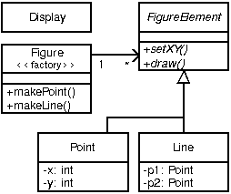

[[starting]]
== Getting Started with AspectJ

[[starting-intro]]
=== Introduction

Many software developers are attracted to the idea of aspect-oriented
programming (AOP) but unsure about how to begin using the technology.
They recognize the concept of crosscutting concerns, and know that they
have had problems with the implementation of such concerns in the past.
But there are many questions about how to adopt AOP into the development
process. Common questions include:

* Can I use aspects in my existing code?
* What kinds of benefits can I expect to get from using aspects?
* How do I find aspects in my programs?
* How steep is the learning curve for AOP?
* What are the risks of using this new technology?

This chapter addresses these questions in the context of AspectJ: a
general-purpose aspect-oriented extension to Java. A series of abridged
examples illustrate the kinds of aspects programmers may want to
implement using AspectJ and the benefits associated with doing so.
Readers who would like to understand the examples in more detail, or who
want to learn how to program examples like these, can find more complete
examples and supporting material linked from the
https://www.eclipse.org/aspectj/[AspectJ web site].

A significant risk in adopting any new technology is going too far too
fast. Concern about this risk causes many organizations to be
conservative about adopting new technology. To address this issue, the
examples in this chapter are grouped into three broad categories, with
aspects that are easier to adopt into existing development projects
coming earlier in this chapter. The next section,
xref:#starting-aspectj[Introduction to AspectJ], we present the core of
AspectJ's features, and in xref:#starting-development[Development
Aspects], we present aspects that facilitate tasks such as debugging,
testing and performance tuning of applications. And, in the section
following, xref:#starting-production[Production Aspects], we present
aspects that implement crosscutting functionality common in Java
applications. We will defer discussing a third category of aspects,
reusable aspects, until xref:language.adoc#language[The AspectJ Language].

These categories are informal, and this ordering is not the only way to
adopt AspectJ. Some developers may want to use a production aspect right
away. But our experience with current AspectJ users suggests that this
is one ordering that allows developers to get experience with (and
benefit from) AOP technology quickly, while also minimizing risk.

[[starting-aspectj]]
=== Introduction to AspectJ

This section presents a brief introduction to the features of AspectJ
used later in this chapter. These features are at the core of the
language, but this is by no means a complete overview of AspectJ.

The features are presented using a simple figure editor system. A
`Figure` consists of a number of `FigureElements`, which can be either
``Point``s or ``Line``s. The `Figure` class provides factory services. There
is also a `Display`. Most example programs later in this chapter are
based on this system as well.

The motivation for AspectJ (and likewise for aspect-oriented
programming) is the realization that there are issues or concerns that
are not well captured by traditional programming methodologies. Consider
the problem of enforcing a security policy in some application. By its
nature, security cuts across many of the natural units of modularity of
the application. Moreover, the security policy must be uniformly applied
to any additions as the application evolves. And the security policy
that is being applied might itself evolve. Capturing concerns like a
security policy in a disciplined way is difficult and error-prone in a
traditional programming language.

Concerns like security cut across the natural units of modularity. For
object-oriented programming languages, the natural unit of modularity is
the class. But in object-oriented programming languages, crosscutting
concerns are not easily turned into classes precisely because they cut
across classes, and so these aren't reusable, they can't be refined or
inherited, they are spread through out the program in an undisciplined
way, in short, they are difficult to work with.

Aspect-oriented programming is a way of modularizing crosscutting
concerns much like object-oriented programming is a way of modularizing
common concerns. AspectJ is an implementation of aspect-oriented
programming for Java.

AspectJ adds to Java just one new concept, a join point -- and that's
really just a name for an existing Java concept. It adds to Java only a
few new constructs: pointcuts, advice, inter-type declarations and
aspects. Pointcuts and advice dynamically affect program flow,
inter-type declarations statically affects a program's class hierarchy,
and aspects encapsulate these new constructs.

A _join point_ is a well-defined point in the program flow. A _pointcut_
picks out certain join points and values at those points. A piece of
_advice_ is code that is executed when a join point is reached. These
are the dynamic parts of AspectJ.

AspectJ also has different kinds of _inter-type declarations_ that allow
the programmer to modify a program's static structure, namely, the
members of its classes and the relationship between classes.

AspectJ's _aspect_ are the unit of modularity for crosscutting concerns.
They behave somewhat like Java classes, but may also include pointcuts,
advice and inter-type declarations.

In the sections immediately following, we are first going to look at
join points and how they compose into pointcuts. Then we will look at
advice, the code which is run when a pointcut is reached. We will see
how to combine pointcuts and advice into aspects, AspectJ's reusable,
inheritable unit of modularity. Lastly, we will look at how to use
inter-type declarations to deal with crosscutting concerns of a
program's class structure.

==== The Dynamic Join Point Model

A critical element in the design of any aspect-oriented language is the
join point model. The join point model provides the common frame of
reference that makes it possible to define the dynamic structure of
crosscutting concerns. This chapter describes AspectJ's dynamic join
points, in which join points are certain well-defined points in the
execution of the program.

AspectJ provides for many kinds of join points, but this chapter
discusses only one of them: method call join points. A method call join
point encompasses the actions of an object receiving a method call. It
includes all the actions that comprise a method call, starting after all
arguments are evaluated up to and including return (either normally or
by throwing an exception).

Each method call at runtime is a different join point, even if it comes
from the same call expression in the program. Many other join points may
run while a method call join point is executing -- all the join points
that happen while executing the method body, and in those methods called
from the body. We say that these join points execute in the _dynamic
context_ of the original call join point.

[[pointcuts-starting]]
==== Pointcuts

In AspectJ, _pointcuts_ pick out certain join points in the program
flow. For example, the pointcut

[source, java]
....
call(void Point.setX(int))
....

picks out each join point that is a call to a method that has the
signature `void Point.setX(int)` - that is, ``Point``'s void `setX` method
with a single `int` parameter.

A pointcut can be built out of other pointcuts with and, or, and not
(spelled `&&`, `||`, and `!`). For example:

[source, java]
....
call(void Point.setX(int)) ||
call(void Point.setY(int))
....

picks out each join point that is either a call to `setX` or a call to
`setY`.

Pointcuts can identify join points from many different types - in other
words, they can crosscut types. For example,

[source, java]
....
call(void FigureElement.setXY(int,int)) ||
call(void Point.setX(int))              ||
call(void Point.setY(int))              ||
call(void Line.setP1(Point))            ||
call(void Line.setP2(Point));
....

picks out each join point that is a call to one of five methods (the
first of which is an interface method, by the way).

In our example system, this pointcut captures all the join points when a
`FigureElement` moves. While this is a useful way to specify this
crosscutting concern, it is a bit of a mouthful. So AspectJ allows
programmers to define their own named pointcuts with the `pointcut`
form. So the following declares a new, named pointcut:

[source, java]
....
pointcut move():
  call(void FigureElement.setXY(int,int)) ||
  call(void Point.setX(int))              ||
  call(void Point.setY(int))              ||
  call(void Line.setP1(Point))            ||
  call(void Line.setP2(Point));
....

and whenever this definition is visible, the programmer can simply use
`move()` to capture this complicated pointcut.

The previous pointcuts are all based on explicit enumeration of a set of
method signatures. We sometimes call this _name-based_ crosscutting.
AspectJ also provides mechanisms that enable specifying a pointcut in
terms of properties of methods other than their exact name. We call this
_property-based_ crosscutting. The simplest of these involve using
wildcards in certain fields of the method signature. For example, the
pointcut

[source, java]
....
call(void Figure.make*(..))
....

picks out each join point that's a call to a void method defined on
`Figure` whose the name begins with "`make`" regardless of the method's
parameters. In our system, this picks out calls to the factory methods
`makePoint` and `makeLine`. The pointcut

[source, java]
....
call(public * Figure.* (..))
....

picks out each call to ``Figure``'s public methods.

But wildcards aren't the only properties AspectJ supports. Another
pointcut, `cflow`, identifies join points based on whether they occur in
the dynamic context of other join points. So

[source, java]
....
cflow(move())
....

picks out each join point that occurs in the dynamic context of the join
points picked out by `move()`, our named pointcut defined above. So this
picks out each join points that occurrs between when a move method is
called and when it returns (either normally or by throwing an
exception).

[[advice-starting]]
==== Advice

So pointcuts pick out join points. But they don't _do_ anything apart
from picking out join points. To actually implement crosscutting
behavior, we use advice. Advice brings together a pointcut (to pick out
join points) and a body of code (to run at each of those join points).

AspectJ has several different kinds of advice. _Before advice_ runs as a
join point is reached, before the program proceeds with the join point.
For example, before advice on a method call join point runs before the
actual method starts running, just after the arguments to the method
call are evaluated.

[source, java]
....
before(): move() {
  System.out.println("about to move");
}
....

_After advice_ on a particular join point runs after the program
proceeds with that join point. For example, after advice on a method
call join point runs after the method body has run, just before before
control is returned to the caller. Because Java programs can leave a
join point 'normally' or by throwing an exception, there are three kinds
of after advice: `after returning`, `after
        throwing`, and plain `after` (which runs after returning _or_
throwing, like Java's `finally`).

[source, java]
....
after() returning: move() {
  System.out.println("just successfully moved");
}
....

_Around advice_ on a join point runs as the join point is reached, and
has explicit control over whether the program proceeds with the join
point. Around advice is not discussed in this section.

===== Exposing Context in Pointcuts

Pointcuts not only pick out join points, they can also expose part of
the execution context at their join points. Values exposed by a pointcut
can be used in the body of advice declarations.

An advice declaration has a parameter list (like a method) that gives
names to all the pieces of context that it uses. For example, the after
advice

[source, java]
....
after(FigureElement fe, int x, int y) returning:
  // SomePointcut...
{
  // SomeBody
}
....

uses three pieces of exposed context, a `FigureElement` named fe, and
two ``int``s named x and y.

The body of the advice uses the names just like method parameters, so

[source, java]
....
after(FigureElement fe, int x, int y) returning:
  // SomePointcut...
{
  System.out.println(fe + " moved to (" + x + ", " + y + ")");
}
....

The advice's pointcut publishes the values for the advice's arguments.
The three primitive pointcuts `this`, `target` and `args` are used to
publish these values. So now we can write the complete piece of advice:

[source, java]
....
after(FigureElement fe, int x, int y) returning:
  call(void FigureElement.setXY(int, int))
  && target(fe)
  && args(x, y)
{
  System.out.println(fe + " moved to (" + x + ", " + y + ")");
}
....

The pointcut exposes three values from calls to `setXY`: the target
`FigureElement` -- which it publishes as `fe`, so it becomes the first
argument to the after advice -- and the two int arguments -- which it
publishes as `x` and `y`, so they become the second and third argument
to the after advice.

So the advice prints the figure element that was moved and its new `x`
and `y` coordinates after each `setXY` method call.

A named pointcut may have parameters like a piece of advice. When the
named pointcut is used (by advice, or in another named pointcut), it
publishes its context by name just like the `this`, `target` and `args`
pointcut. So another way to write the above advice is

[source, java]
....
pointcut setXY(FigureElement fe, int x, int y):
  call(void FigureElement.setXY(int, int))
  && target(fe)
  && args(x, y);

after(FigureElement fe, int x, int y) returning: setXY(fe, x, y) {
  System.out.println(fe + " moved to (" + x + ", " + y + ").");
}
....

==== Inter-type declarations

Inter-type declarations in AspectJ are declarations that cut across
classes and their hierarchies. They may declare members that cut across
multiple classes, or change the inheritance relationship between
classes. Unlike advice, which operates primarily dynamically,
introduction operates statically, at compile-time.

Consider the problem of expressing a capability shared by some existing
classes that are already part of a class hierarchy, i.e. they already
extend a class. In Java, one creates an interface that captures this new
capability, and then adds to _each affected class_ a method that
implements this interface.

AspectJ can express the concern in one place, by using inter-type
declarations. The aspect declares the methods and fields that are
necessary to implement the new capability, and associates the methods
and fields to the existing classes.

Suppose we want to have `Screen` objects observe changes to `Point`
objects, where `Point` is an existing class. We can implement this by
writing an aspect declaring that the class Point `Point` has an instance
field, `observers`, that keeps track of the `Screen` objects that are
observing ``Point``s.

[source, java]
....
aspect PointObserving {
  private Vector Point.observers = new Vector();
  // ...
}
....

The `observers` field is private, so only `PointObserving` can see it.
So observers are added or removed with the static methods `addObserver`
and `removeObserver` on the aspect.

[source, java]
....
aspect PointObserving {
  private Vector Point.observers = new Vector();

  public static void addObserver(Point p, Screen s) {
    p.observers.add(s);
  }
  public static void removeObserver(Point p, Screen s) {
    p.observers.remove(s);
  }
  //...
}
....

Along with this, we can define a pointcut `changes` that defines what we
want to observe, and the after advice defines what we want to do when we
observe a change.

[source, java]
....
aspect PointObserving {
  private Vector Point.observers = new Vector();

  public static void addObserver(Point p, Screen s) {
    p.observers.add(s);
  }
  public static void removeObserver(Point p, Screen s) {
    p.observers.remove(s);
  }

  pointcut changes(Point p): target(p) && call(void Point.set*(int));

  after(Point p): changes(p) {
    Iterator iter = p.observers.iterator();
    while ( iter.hasNext() ) {
      updateObserver(p, (Screen)iter.next());
    }
  }

  static void updateObserver(Point p, Screen s) {
    s.display(p);
  }
}
....

Note that neither ``Screen``'s nor ``Point``'s code has to be modified, and
that all the changes needed to support this new capability are local to
this aspect.

==== Aspects

Aspects wrap up pointcuts, advice, and inter-type declarations in a a
modular unit of crosscutting implementation. It is defined very much
like a class, and can have methods, fields, and initializers in addition
to the crosscutting members. Because only aspects may include these
crosscutting members, the declaration of these effects is localized.

Like classes, aspects may be instantiated, but AspectJ controls how that
instantiation happens -- so you can't use Java's `new` form to build new
aspect instances. By default, each aspect is a singleton, so one aspect
instance is created. This means that advice may use non-static fields of
the aspect, if it needs to keep state around:

[source, java]
....
aspect Logging {
  OutputStream logStream = System.err;

  before(): move() {
    logStream.println("about to move");
  }
}
....

Aspects may also have more complicated rules for instantiation, but
these will be described in a later chapter.

[[starting-development]]
=== Development Aspects

The next two sections present the use of aspects in increasingly
sophisticated ways. Development aspects are easily removed from
production builds. Production aspects are intended to be used in both
development and in production, but tend to affect only a few classes.

This section presents examples of aspects that can be used during
development of Java applications. These aspects facilitate debugging,
testing and performance tuning work. The aspects define behavior that
ranges from simple tracing, to profiling, to testing of internal
consistency within the application. Using AspectJ makes it possible to
cleanly modularize this kind of functionality, thereby making it
possible to easily enable and disable the functionality when desired.

==== Tracing

This first example shows how to increase the visibility of the internal
workings of a program. It is a simple tracing aspect that prints a
message at specified method calls. In our figure editor example, one
such aspect might simply trace whenever points are drawn.

[source, java]
....
aspect SimpleTracing {
  pointcut tracedCall():
    call(void FigureElement.draw(GraphicsContext));

  before(): tracedCall() {
    System.out.println("Entering: " + thisJoinPoint);
  }
}
....

This code makes use of the `thisJoinPoint` special variable. Within all
advice bodies this variable is bound to an object that describes the
current join point. The effect of this code is to print a line like the
following every time a figure element receives a `draw` method call:

[source, text]
....
Entering: call(void FigureElement.draw(GraphicsContext))
....

To understand the benefit of coding this with AspectJ consider changing
the set of method calls that are traced. With AspectJ, this just
requires editing the definition of the `tracedCalls` pointcut and
recompiling. The individual methods that are traced do not need to be
edited.

When debugging, programmers often invest considerable effort in figuring
out a good set of trace points to use when looking for a particular kind
of problem. When debugging is complete or appears to be complete it is
frustrating to have to lose that investment by deleting trace statements
from the code. The alternative of just commenting them out makes the
code look bad, and can cause trace statements for one kind of debugging
to get confused with trace statements for another kind of debugging.

With AspectJ it is easy to both preserve the work of designing a good
set of trace points and disable the tracing when it isn't being used.
This is done by writing an aspect specifically for that tracing mode,
and removing that aspect from the compilation when it is not needed.

This ability to concisely implement and reuse debugging configurations
that have proven useful in the past is a direct result of AspectJ
modularizing a crosscutting design element the set of methods that are
appropriate to trace when looking for a given kind of information.

==== Profiling and Logging

Our second example shows you how to do some very specific profiling.
Although many sophisticated profiling tools are available, and these can
gather a variety of information and display the results in useful ways,
you may sometimes want to profile or log some very specific behavior. In
these cases, it is often possible to write a simple aspect similar to
the ones above to do the job.

For example, the following aspect counts the number of calls to the
`rotate` method on a `Line` and the number of calls to the `set*`
methods of a `Point` that happen within the control flow of those calls
to `rotate`:

[source, java]
....
aspect SetsInRotateCounting {
  int rotateCount = 0;
  int setCount = 0;

  before(): call(void Line.rotate(double)) {
    rotateCount++;
  }

  before():
    call(void Point.set*(int)) &&
    cflow(call(void Line.rotate(double)))
  {
    setCount++;
  }
}
....

In effect, this aspect allows the programmer to ask very specific
questions like

____
How many times is the `rotate` method defined on `Line` objects called?
____

and

____
How many times are methods defined on `Point` objects whose name begins with
`"set"` called in fulfilling those `rotate` calls?
____

Such questions may be difficult to express using standard profiling or
logging tools.

[[pre-and-post-conditions]]
==== Pre- and Post-Conditions

Many programmers use the "Design by Contract" style popularized by
Bertand Meyer in Object-Oriented Software Construction, 2/e. In this
style of programming, explicit pre-conditions test that callers of a
method call it properly and explicit post-conditions test that methods
properly do the work they are supposed to.

AspectJ makes it possible to implement pre- and post-condition testing
in modular form. For example, this code

[source, java]
....
aspect PointBoundsChecking {

  pointcut setX(int x):
    (call(void FigureElement.setXY(int, int)) && args(x, *))
    || (call(void Point.setX(int)) && args(x));

  pointcut setY(int y):
    (call(void FigureElement.setXY(int, int)) && args(*, y))
    || (call(void Point.setY(int)) && args(y));

  before(int x): setX(x) {
    if ( x < MIN_X || x > MAX_X )
      throw new IllegalArgumentException("x is out of bounds.");
  }

  before(int y): setY(y) {
    if ( y < MIN_Y || y > MAX_Y )
      throw new IllegalArgumentException("y is out of bounds.");
  }
}
....

implements the bounds checking aspect of pre-condition testing for
operations that move points. Notice that the `setX` pointcut refers to
all the operations that can set a Point's `x` coordinate; this includes
the `setX` method, as well as half of the `setXY` method. In this sense
the `setX` pointcut can be seen as involving very fine-grained
crosscutting - it names the the `setX` method and half of the `setXY`
method.

Even though pre- and post-condition testing aspects can often be used
only during testing, in some cases developers may wish to include them
in the production build as well. Again, because AspectJ makes it
possible to modularize these crosscutting concerns cleanly, it gives
developers good control over this decision.

==== Contract Enforcement

The property-based crosscutting mechanisms can be very useful in
defining more sophisticated contract enforcement. One very powerful use
of these mechanisms is to identify method calls that, in a correct
program, should not exist. For example, the following aspect enforces
the constraint that only the well-known factory methods can add an
element to the registry of figure elements. Enforcing this constraint
ensures that no figure element is added to the registry more than once.

[source, java]
....
aspect RegistrationProtection {

  pointcut register(): call(void Registry.register(FigureElement));
  pointcut canRegister(): withincode(static * FigureElement.make*(..));

  before(): register() && !canRegister() {
    throw new IllegalAccessException("Illegal call " + thisJoinPoint);
  }
}
....

This aspect uses the withincode primitive pointcut to denote all join
points that occur within the body of the factory methods on
`FigureElement` (the methods with names that begin with "`make`"). This
is a property-based pointcut because it identifies join points based not
on their signature, but rather on the property that they occur
specifically within the code of another method. The before advice
declaration effectively says signal an error for any calls to register
that are not within the factory methods.

This advice throws a runtime exception at certain join points, but
AspectJ can do better. Using the `declare error` form, we can have the
_compiler_ signal the error.

[source, java]
....
aspect RegistrationProtection {

  pointcut register(): call(void Registry.register(FigureElement));
  pointcut canRegister(): withincode(static * FigureElement.make*(..));

  declare error: register() && !canRegister(): "Illegal call"
}
....

When using this aspect, it is impossible for the compiler to compile
programs with these illegal calls. This early detection is not always
possible. In this case, since we depend only on static information (the
`withincode` pointcut picks out join points totally based on their code,
and the `call` pointcut here picks out join points statically). Other
enforcement, such as the precondition enforcement, above, does require
dynamic information such as the runtime value of parameters.

==== Configuration Management

Configuration management for aspects can be handled using a variety of
make-file like techniques. To work with optional aspects, the programmer
can simply define their make files to either include the aspect in the
call to the AspectJ compiler or not, as desired.

Developers who want to be certain that no aspects are included in the
production build can do so by configuring their make files so that they
use a traditional Java compiler for production builds. To make it easy
to write such make files, the AspectJ compiler has a command-line
interface that is consistent with ordinary Java compilers.

[[starting-production]]
=== Production Aspects

This section presents examples of aspects that are inherently intended
to be included in the production builds of an application. Production
aspects tend to add functionality to an application rather than merely
adding more visibility of the internals of a program. Again, we begin
with name-based aspects and follow with property-based aspects.
Name-based production aspects tend to affect only a small number of
methods. For this reason, they are a good next step for projects
adopting AspectJ. But even though they tend to be small and simple, they
can often have a significant effect in terms of making the program
easier to understand and maintain.

==== Change Monitoring

The first example production aspect shows how one might implement some
simple functionality where it is problematic to try and do it
explicitly. It supports the code that refreshes the display. The role of
the aspect is to maintain a dirty bit indicating whether or not an
object has moved since the last time the display was refreshed.

Implementing this functionality as an aspect is straightforward. The
`testAndClear` method is called by the display code to find out whether
a figure element has moved recently. This method returns the current
state of the dirty flag and resets it to false. The pointcut `move`
captures all the method calls that can move a figure element. The after
advice on `move` sets the dirty flag whenever an object moves.

[source, java]
....
aspect MoveTracking {
  private static boolean dirty = false;

  public static boolean testAndClear() {
    boolean result = dirty;
    dirty = false;
    return result;
  }

  pointcut move():
    call(void FigureElement.setXY(int, int)) ||
    call(void Line.setP1(Point))             ||
    call(void Line.setP2(Point))             ||
    call(void Point.setX(int))               ||
    call(void Point.setY(int));

  after() returning: move() {
    dirty = true;
  }
}
....

Even this simple example serves to illustrate some of the important
benefits of using AspectJ in production code. Consider implementing this
functionality with ordinary Java: there would likely be a helper class
that contained the `dirty` flag, the `testAndClear` method, as well as a
`setFlag` method. Each of the methods that could move a figure element
would include a call to the `setFlag` method. Those calls, or rather the
concept that those calls should happen at each move operation, are the
crosscutting concern in this case.

The AspectJ implementation has several advantages over the standard
implementation:

_The structure of the crosscutting concern is captured explicitly._ The
moves pointcut clearly states all the methods involved, so the
programmer reading the code sees not just individual calls to `setFlag`,
but instead sees the real structure of the code. The IDE support
included with AspectJ automatically reminds the programmer that this
aspect advises each of the methods involved. The IDE support also
provides commands to jump to the advice from the method and vice-versa.

_Evolution is easier._ If, for example, the aspect needs to be revised
to record not just that some figure element moved, but rather to record
exactly which figure elements moved, the change would be entirely local
to the aspect. The pointcut would be updated to expose the object being
moved, and the advice would be updated to record that object. The paper
An Overview of AspectJ (available linked off of the AspectJ web site --
https://eclipse.org/aspectj[]), presented at ECOOP 2001, presents a
detailed discussion of various ways this aspect could be expected to
evolve.

_The functionality is easy to plug in and out._ Just as with development
aspects, production aspects may need to be removed from the system,
either because the functionality is no longer needed at all, or because
it is not needed in certain configurations of a system. Because the
functionality is modularized in a single aspect this is easy to do.

_The implementation is more stable._ If, for example, the programmer
adds a subclass of `Line` that overrides the existing methods, this
advice in this aspect will still apply. In the ordinary Java
implementation the programmer would have to remember to add the call to
`setFlag` in the new overriding method. This benefit is often even more
compelling for property-based aspects (see the section
xref:#starting-production-consistentBehavior[Providing Consistent
Behavior]).

==== Context Passing

The crosscutting structure of context passing can be a significant
source of complexity in Java programs. Consider implementing
functionality that would allow a client of the figure editor (a program
client rather than a human) to set the color of any figure elements that
are created. Typically this requires passing a color, or a color
factory, from the client, down through the calls that lead to the figure
element factory. All programmers are familiar with the inconvenience of
adding a first argument to a number of methods just to pass this kind of
context information.

Using AspectJ, this kind of context passing can be implemented in a
modular way. The following code adds after advice that runs only when
the factory methods of `Figure` are called in the control flow of a
method on a `ColorControllingClient`.

[source, java]
....
aspect ColorControl {
  pointcut CCClientCflow(ColorControllingClient client):
    cflow(call(* * (..)) && target(client));

  pointcut make(): call(FigureElement Figure.make*(..));

  after (ColorControllingClient c) returning (FigureElement fe):
    make() && CCClientCflow(c)
  {
    fe.setColor(c.colorFor(fe));
  }
}
....

This aspect affects only a small number of methods, but note that the
non-AOP implementation of this functionality might require editing many
more methods, specifically, all the methods in the control flow from the
client to the factory. This is a benefit common to many property-based
aspects while the aspect is short and affects only a modest number of
benefits, the complexity the aspect saves is potentially much larger.

[[starting-production-consistentBehavior]]
==== Providing Consistent Behavior

This example shows how a property-based aspect can be used to provide
consistent handling of functionality across a large set of operations.
This aspect ensures that all public methods of the `com.bigboxco`
package log any Errors they throw to their caller (in Java, an Error is
like an Exception, but it indicates that something really bad and
usually unrecoverable has happened). The `publicMethodCall` pointcut
captures the public method calls of the package, and the after advice
runs whenever one of those calls throws an Error. The advice logs that
Error and then the throw resumes.

[source, java]
....
aspect PublicErrorLogging {
  Log log = new Log();

  pointcut publicMethodCall():
    call(public * com.bigboxco.*.*(..));

  after() throwing (Error e): publicMethodCall() {
    log.write(e);
  }
}
....

In some cases this aspect can log an exception twice. This happens if
code inside the `com.bigboxco` package itself calls a public method of
the package. In that case this code will log the error at both the
outermost call into the `com.bigboxco` package and the re-entrant call.
The `cflow` primitive pointcut can be used in a nice way to exclude
these re-entrant calls:

[source, java]
....
after() throwing (Error e):
  publicMethodCall() && !cflow(publicMethodCall())
{
  log.write(e);
}
....

The following aspect is taken from work on the AspectJ compiler. The
aspect advises about 35 methods in the `JavaParser` class. The
individual methods handle each of the different kinds of elements that
must be parsed. They have names like `parseMethodDec`, `parseThrows`,
and `parseExpr`.

[source, java]
....
aspect ContextFilling {
  pointcut parse(JavaParser jp):
    call(* JavaParser.parse*(..))
    && target(jp)
    && !call(Stmt parseVarDec(boolean)); // var decs  are tricky

  around(JavaParser jp) returns ASTObject: parse(jp) {
    Token beginToken = jp.peekToken();
    ASTObject ret = proceed(jp);
    if (ret != null) jp.addContext(ret, beginToken);
      return ret;
  }
}
....

This example exhibits a property found in many aspects with large
property-based pointcuts. In addition to a general property based
pattern `call(* JavaParser.parse*(..))` it includes an exception to the
pattern `!call(Stmt parseVarDec(boolean))`. The exclusion of `parseVarDec` happens
because the parsing of variable declarations in Java is too complex to
fit with the clean pattern of the other `parse*` methods. Even with the
explicit exclusion this aspect is a clear expression of a clean
crosscutting modularity. Namely that all `parse*` methods that return
`ASTObjects`, except for `parseVarDec` share a common behavior for
establishing the parse context of their result.

The process of writing an aspect with a large property-based pointcut,
and of developing the appropriate exceptions can clarify the structure
of the system. This is especially true, as in this case, when
refactoring existing code to use aspects. When we first looked at the
code for this aspect, we were able to use the IDE support provided in
AJDE for JBuilder to see what methods the aspect was advising compared
to our manual coding. We quickly discovered that there were a dozen
places where the aspect advice was in effect but we had not manually
inserted the required functionality. Two of these were bugs in our prior
non-AOP implementation of the parser. The other ten were needless
performance optimizations. So, here, refactoring the code to express the
crosscutting structure of the aspect explicitly made the code more
concise and eliminated latent bugs.

[[starting-conclusion]]
=== Conclusion

AspectJ is a simple and practical aspect-oriented extension to Java.
With just a few new constructs, AspectJ provides support for modular
implementation of a range of crosscutting concerns.

Adoption of AspectJ into an existing Java development project can be a
straightforward and incremental task. One path is to begin by using only
development aspects, going on to using production aspects and then
reusable aspects after building up experience with AspectJ. Adoption can
follow other paths as well. For example, some developers will benefit
from using production aspects right away. Others may be able to write
clean reusable aspects almost right away.

AspectJ enables both name-based and property based crosscutting. Aspects
that use name-based crosscutting tend to affect a small number of other
classes. But despite their small scale, they can often eliminate
significant complexity compared to an ordinary Java implementation.
Aspects that use property-based crosscutting can have small or large
scale.

Using AspectJ results in clean well-modularized implementations of
crosscutting concerns. When written as an AspectJ aspect the structure
of a crosscutting concern is explicit and easy to understand. Aspects
are also highly modular, making it possible to develop plug-and-play
implementations of crosscutting functionality.

AspectJ provides more functionality than was covered by this short
introduction. The next chapter, xref:language.adoc#language[The AspectJ Language], covers in detail
more of the features of the AspectJ language. The following chapter,
xref:examples.adoc#examples[Examples], then presents some carefully chosen examples that
show you how AspectJ might be used. We recommend that you read the next
two chapters carefully before deciding to adopt AspectJ into a project.
