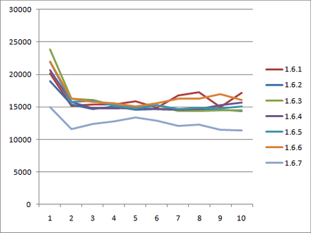

= AspectJ 1.6.7

_© Copyright 2009 Contributors. All rights reserved._

AspectJ 1.6.7 includes some radical internal changes. These improvements
enable faster compilation, faster binary weaving, faster load time
weaving and in some situations faster generated code.

== Pointcut timers

Until 1.6.7 there has not really been a way to determine if it is just
one of your pointcuts that is hurting your weaving performance. In 1.6.7
it is possible to turn on timers for pointcuts. These timers show the
time spent in the weaver matching the pointcut components against join
points. The details on this feature are here:
https://andrewclement.blogspot.com/2009/11/aspectj-profiling-pointcut-matching.html[Profiling
pointcut matching]. Basically by turning on the options '-timers
-verbose' on the command line (or via Ant), output will be produced that
looks a little like this:

[source, text]
....
Pointcut matching cost (total=6532ms for 675000 joinpoint match calls):
Time:482ms (jps:#168585) matching against
    (staticinitialization(*y*.()) && persingleton(SimpleAspect))
Time:3970ms (jps:#168585) matching against
    (execution(* *t*.*(*)) && persingleton(SimpleAspect))
Time:538ms (jps:#168584) matching against
    (execution(* *f*(..)) && persingleton(SimpleAspect))
Time:1536ms (jps:#168584) matching against
    (execution(* java.lang.CharSequence+.*e*(..)) && persingleton(SimpleAspect))
Time:4ms (jps:#662) matching against
    (within(*p*) && persingleton(SimpleAspect))
....

It shows the component, the number of joinpoints (jps) the weaver
attempted to match it against and how many milliseconds were spent
performing those matches. The options can also be turned on
https://contraptionsforprogramming.blogspot.com/2009/11/getting-aspectj-pointcut-matching-timer.html[]through
AJDT. Armed with this information you can optimize your pointcuts or
post on the mailing list asking for help. The timers can even be turned
on for load time weaving.

== Faster matching

The changes to enable pointcut profiling enabled some targeted work to
be done on the matching algorithms. These have remained unchanged for a
few years, but in 1.6.7 have received a bit of an overhaul. 'Fast match'
has been implemented for the execution() pointcut, drastically reducing
weave times for heavy users of execution - more details
https://andrewclement.blogspot.com/2009/11/aspectj-how-much-faster-is-aspectj-167.html[here].
The pointcut cost calculator (which is used to sort pointcuts to
optimize matching speed) has been reviewed and after determining that
this() ought to be considered cheaper than call() - any user combining
those two pointcut designators should see an improvement (one users
build time reduced from 38minutes to 6minutes with that change!).

As well as faster matching there is also less exploration to determine a
match. Visitors that walk hierarchies and discover methods now terminate
as early as possible once they can determine something is a match or is
definetly not a match. This reduces memory usage, speeds up weaving and
reduces the occurrences of those annoying 'cantFindType' messages.

== aop.xml processing

The processing of include/exclude entries in aop.xml has been rewritten.
It now optimizes for many more common patterns. If a pattern is
optimized then there is no need to ask the weaver to do an expensive
include/exclude match. More details
https://andrewclement.blogspot.com/2009/12/aspectj-167-and-faster-load-time.html[here].

== Less need to tweak options for load time weaving

A number of options were previously configurable for load time weaving
that were considered experimental. These options have now been tested
enough in the field that they are considered fully reliable and are on
by default in 1.6.7. If you have been using either of these:

* typeDemotion
* runMinimalMemory

then please delete them from your weaver options section, the weaver
will now do the right thing out of the box.

== Benchmarking memory and performance

All those changes above, and some additional tweaks, mean we are now
using less memory than ever before and getting things done more quickly.

https://andrewclement.blogspot.com/2009/12/aspectj-167-and-faster-load-time.html[This
post] discusses the details. From that article, the graph below shows
the speed and memory consumption of the various AspectJ 1.6 releases
when load time weaving a small application loading in Tomcat. For each
of 10 iterations (x axis), the top comparison is startup time in
milliseconds, the lower comparison is memory used in bytes.

image:images/167Memory.png[image]

== Annotation binding

All those changes affect compilation/weaving but what about the code
that actually runs? One user, Oliver Hoff, raised a query on the
performance of annotation binding. His case uncovered an old TODO left
in the code a few years ago:

[source, text]
....
// OPTIMIZE cache result of getDeclaredMethod and getAnnotation?
....

Annotation binding has become a very common use case since that was
written and 1.6.7 was the time TODO it.

The result is an optimization for the general case of binding an
annotation, but also support for a new bit of syntax that aids binding
of a string annotation member value - using this latter syntax generates
extremely fast code.

Here are some numbers for a simple benchmark retrieving the annotation
value at an execution join point in different ways. The three scenarios
look like this (where the annotation type is 'Marker' and it has a
String value field called 'message'):

[source, java]
....
// CaseOne: annotation value fetching is done in the advice:
pointcut adviceRetrievesAnnotation(): execution(@Marker * runOne(..));
before(): adviceRetrievesAnnotation() {
  Marker marker = (Marker) ((MethodSignature)
      thisJoinPointStaticPart.getSignature()).getMethod().getAnnotation(Marker.class);
  String s = marker.message();
}

// CaseTwo: annotation binding is done in the pointcut, advice retrieves message
pointcut pointcutBindsAnnotation(Marker l): execution(@Marker * runTwo(..)) && @annotation(l);
before(Marker l): pointcutBindsAnnotation(l) {
  String s = l.message();
}

// CaseThree: annotation binding directly targets the message value in the annotation
pointcut pointcutBindsAnnotationValue(String msg):
  execution(@Marker * runThree(..)) && @annotation(Marker(msg));
before(String s): pointcutBindsAnnotationValue(s) {
  // already got the string
}
....

Before 1.6.7, case 2 was slower than case 1 and case 3 wasn't supported
syntax. The two bugs with more info are
https://bugs.eclipse.org/bugs/show_bug.cgi?id=296484[Bug 296484] and
https://bugs.eclipse.org/bugs/show_bug.cgi?id=296501[Bug 296501].

Now this is a micro benchmark, slightly unrepresentative of the real
world because the advice isn't doing anything else, but it does really
stress the AspectJ binding code. For the benchmark numbers the join
points advised by those advice were invoked 1,000,000 times. AspectJ
1.6.7:

[source, text]
....
Manually fetching annotation with getAnnotation(): 645ms
Binding annotation with @annotation(Marker): 445ms  (was >20 *seconds* for 1.6.6, due to an extra reflection call)
Binding annotation value with @annotation(Marker(message)): 3ms
....

The new syntax is definetly the best way to bind an annotation string
value.

'''''

[[bugsfixed]]
=== Bugs fixed

The complete list of issues resolved for AspectJ 1.6.7 can be found with
this bugzilla query:

* https://bugs.eclipse.org/bugs/buglist.cgi?query_format=advanced&short_desc_type=allwordssubstr&short_desc=&product=AspectJ&target_milestone=1.6.7&long_desc_type=allwordssubstr&long_desc=&bug_file_loc_type=allwordssubstr&bug_file_loc=&status_whiteboard_type=allwordssubstr&status_whiteboard=&keywords_type=allwords&keywords=&bug_status=RESOLVED&bug_status=VERIFIED&bug_status=CLOSED&emailtype1=substring&email1=&emailtype2=substring&email2=&bugidtype=include&bug_id=&votes=&chfieldfrom=&chfieldto=Now&chfieldvalue=&cmdtype=doit&order=Reuse+same+sort+as+last+time&field0-0-0=noop&type0-0-0=noop&value0-0-0=[Bugs
resolved]

'''''
